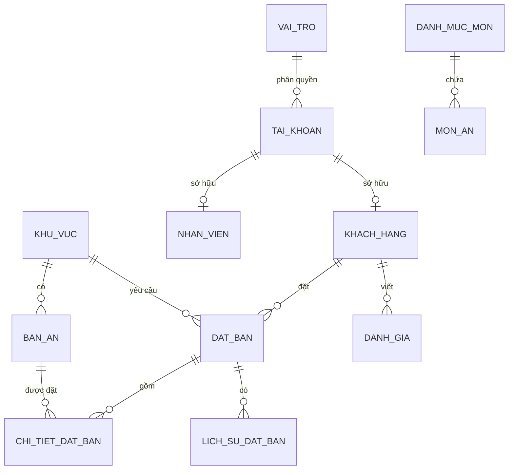
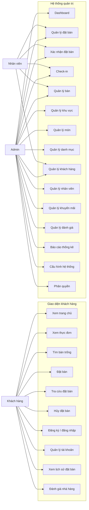
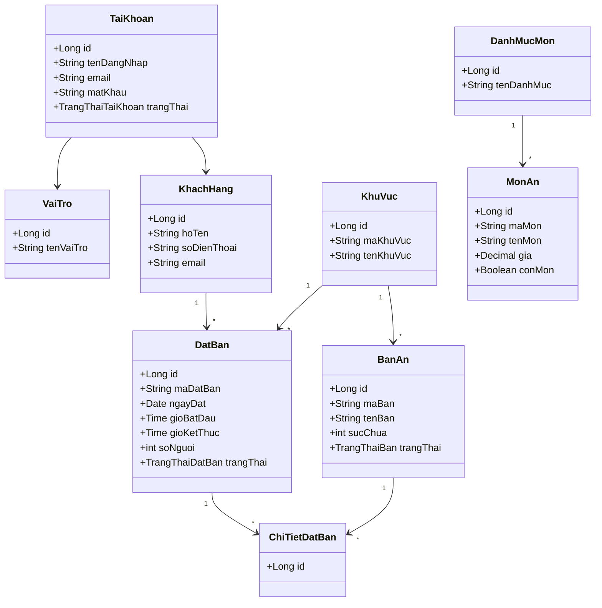
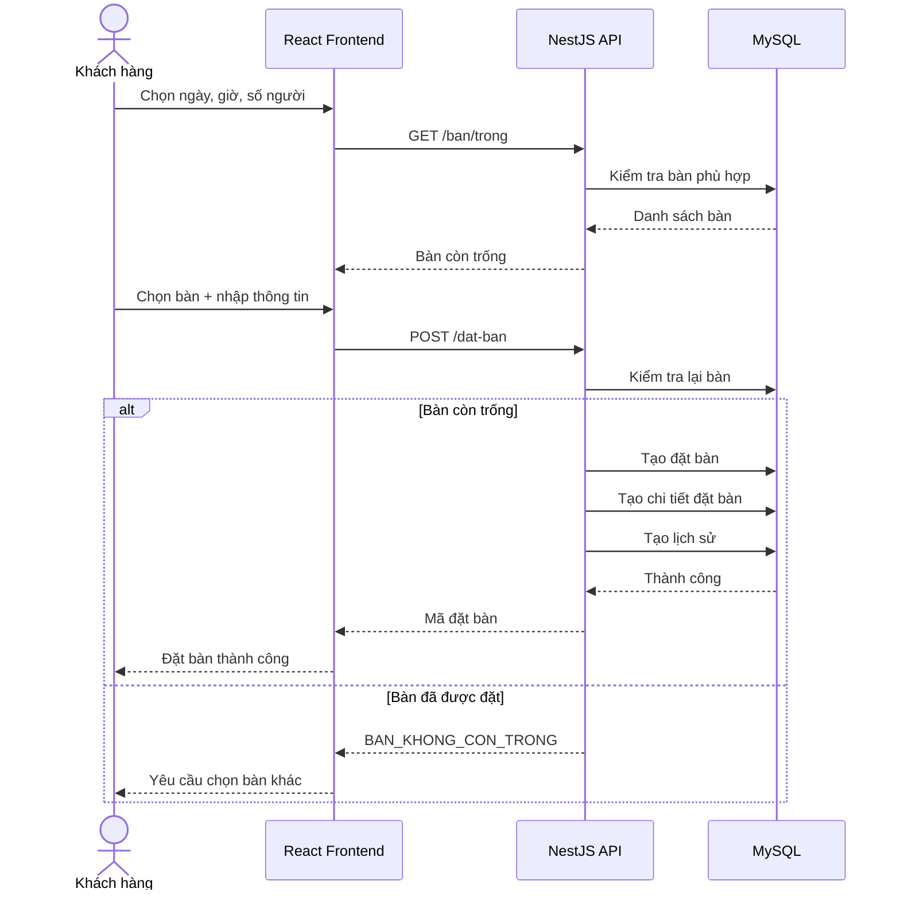
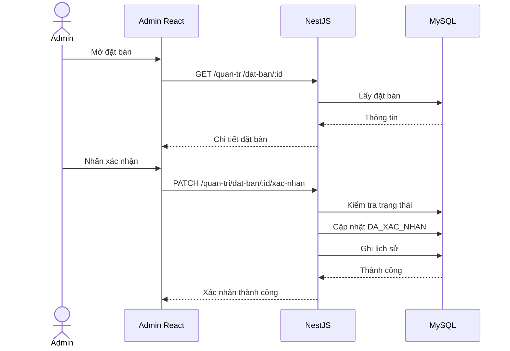
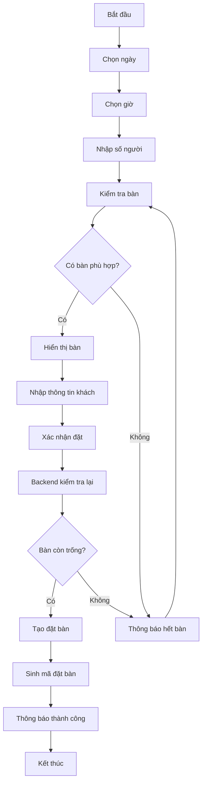
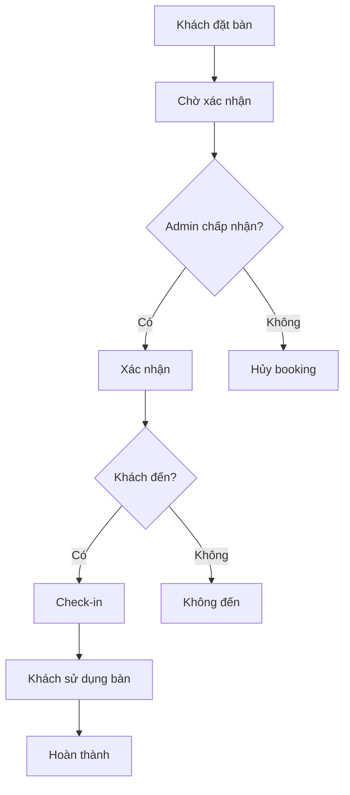

# HỆ THỐNG QUẢN LÝ NHÀ HÀNG VÀ ĐẶT BÀN

## 1. Mục tiêu hệ thống

Xây dựng website quản lý nhà hàng gồm hai khu vực chính:

- Giao diện dành cho **khách hàng**.
- Giao diện quản trị dành cho **Admin/Nhân viên**.

Hệ thống hỗ trợ khách hàng xem thông tin nhà hàng, món ăn, kiểm tra bàn trống, đặt bàn, theo dõi lịch đặt và đánh giá nhà hàng.

Admin quản lý toàn bộ dữ liệu nhà hàng gồm bàn, khu vực, đặt bàn, khách hàng, món ăn, danh mục món, tài khoản, nhân viên, khuyến mãi, đánh giá, báo cáo và cấu hình hệ thống.

---

# 2. Công nghệ đề xuất

## Frontend

- ReactJS
- TypeScript
- Vite
- Ant Design
- React Router
- Axios
- TanStack Query
- Zustand hoặc Redux Toolkit
- React Hook Form
- Day.js
- Recharts
- ESLint
- Prettier

## Backend

- Node.js
- NestJS
- TypeScript
- REST API
- Swagger / OpenAPI
- JWT Authentication
- Refresh Token
- class-validator
- Prisma ORM hoặc TypeORM

Khuyến nghị:

**NestJS + Prisma + MySQL**

vì cấu trúc rõ ràng và dễ đọc hơn cho project học tập hoặc đồ án.

## Database

- MySQL Server
- MySQL Workbench

## API documentation

Swagger:

```text
http://localhost:8080/api/tai-lieu
```

---

# 3. Kiến trúc hệ thống

```text
                         INTERNET
                            │
                            ▼
                    ┌───────────────┐
                    │ ReactJS + TS  │
                    │   Frontend    │
                    └───────┬───────┘
                            │
                       REST API
                            │
                            ▼
                    ┌───────────────┐
                    │ NestJS API    │
                    │   Backend     │
                    └───────┬───────┘
                            │
                      Prisma ORM
                            │
                            ▼
                    ┌───────────────┐
                    │     MySQL     │
                    └───────────────┘
```

Frontend chia làm hai giao diện:

```text
Frontend
│
├── Khách hàng
│
│   ├── Trang chủ
│   ├── Thực đơn
│   ├── Đặt bàn
│   ├── Tra cứu đặt bàn
│   ├── Tài khoản
│   └── Đánh giá
│
└── Quản trị
    │
    ├── Dashboard
    ├── Đặt bàn
    ├── Bàn ăn
    ├── Khu vực
    ├── Món ăn
    ├── Danh mục
    ├── Khách hàng
    ├── Nhân viên
    ├── Khuyến mãi
    ├── Đánh giá
    ├── Báo cáo
    └── Cấu hình
```

---

# 4. Actor của hệ thống

## Actor 1 — Khách vãng lai

Người chưa đăng nhập.

Có thể:

- xem trang chủ;
- xem thông tin nhà hàng;
- xem thực đơn;
- xem món ăn;
- kiểm tra bàn trống;
- đặt bàn;
- đăng ký;
- đăng nhập;
- tra cứu đặt bàn bằng mã đặt bàn và số điện thoại.

---

# 5. Actor 2 — Khách hàng

Khách hàng đã có tài khoản.

Có toàn bộ quyền của khách vãng lai và:

- quản lý hồ sơ;
- xem lịch sử đặt bàn;
- hủy đặt bàn;
- thay đổi thông tin đặt bàn nếu được phép;
- lưu thông tin liên hệ;
- đánh giá nhà hàng;
- xem ưu đãi;
- nhận thông báo.

---

# 6. Actor 3 — Nhân viên

Nhân viên nhà hàng.

Có thể:

- xem danh sách đặt bàn;
- xác nhận đặt bàn;
- sắp bàn;
- check-in khách;
- cập nhật trạng thái bàn;
- ghi chú đặt bàn;
- tạo đặt bàn cho khách gọi điện trực tiếp;
- xem thông tin khách hàng.

Không được:

- xóa tài khoản Admin;
- thay đổi quyền hệ thống;
- thay đổi cấu hình quan trọng.

---

# 7. Actor 4 — Admin

Có toàn bộ quyền quản trị.

Bao gồm:

- Dashboard.
- Quản lý đặt bàn.
- Quản lý bàn.
- Quản lý khu vực.
- Quản lý món.
- Quản lý danh mục.
- Quản lý khách hàng.
- Quản lý nhân viên.
- Quản lý tài khoản.
- Quản lý vai trò.
- Quản lý khuyến mãi.
- Quản lý đánh giá.
- Báo cáo thống kê.
- Nhật ký hoạt động.
- Cấu hình hệ thống.

---

# 8. Phân quyền

Có thể thiết kế 3 vai trò:

```text
KHACH_HANG
NHAN_VIEN
QUAN_TRI_VIEN
```

Ma trận quyền:

| Chức năng | Khách | Nhân viên | Admin |
|---|---:|---:|---:|
| Xem món | ✓ | ✓ | ✓ |
| Đặt bàn | ✓ | ✓ | ✓ |
| Lịch sử đặt bàn | ✓ | ✓ | ✓ |
| Xác nhận đặt bàn | | ✓ | ✓ |
| Check-in | | ✓ | ✓ |
| Quản lý bàn | | ✓ | ✓ |
| Quản lý món | | | ✓ |
| Khách hàng | | ✓ | ✓ |
| Nhân viên | | | ✓ |
| Phân quyền | | | ✓ |
| Báo cáo | | | ✓ |
| Cấu hình hệ thống | | | ✓ |

---

# 9. Nghiệp vụ đặt bàn

Đây là nghiệp vụ quan trọng nhất.

## Luồng chuẩn

Khách:

```text
Chọn ngày
   ↓
Chọn giờ
   ↓
Chọn số người
   ↓
Hệ thống kiểm tra bàn
   ↓
Hiển thị bàn/khu vực phù hợp
   ↓
Khách nhập thông tin
   ↓
Xác nhận
   ↓
Hệ thống tạo đặt bàn
   ↓
Sinh mã đặt bàn
   ↓
Admin/Nhân viên xác nhận
   ↓
Khách đến nhà hàng
   ↓
Check-in
   ↓
Hoàn thành
```

---

# 10. Trạng thái đặt bàn

```text
CHO_XAC_NHAN
DA_XAC_NHAN
DA_CHECK_IN
DA_HOAN_THANH
DA_HUY
KHONG_DEN
```

Không nên dùng các chuỗi tiếng Anh kiểu:

```text
PENDING
CONFIRMED
CANCELLED
```

nếu mục tiêu của project là dễ đọc bằng tiếng Việt.

---

# 11. Quy tắc đặt bàn

Ví dụ cấu hình:

```text
Thời gian mỗi lượt: 120 phút

Thời gian đặt trước tối thiểu: 30 phút

Thời gian đặt trước tối đa: 30 ngày

Số người tối thiểu: 1

Số người tối đa mặc định: 20
```

Admin có thể thay đổi các giá trị này trong cấu hình.

---

# 12. Kiểm tra bàn trống

Ví dụ:

Khách muốn đặt:

```text
Ngày: 20/08/2026
Giờ: 19:00
Số người: 4
```

Hệ thống tìm bàn:

```text
suc_chua >= 4
```

sau đó loại bỏ những bàn có lịch đặt bị trùng.

Điều kiện trùng:

```text
thoi_gian_bat_dau_moi < thoi_gian_ket_thuc_cu

VÀ

thoi_gian_ket_thuc_moi > thoi_gian_bat_dau_cu
```

Nếu thỏa cả hai điều kiện thì lịch đặt bị trùng.

---

# 13. Tránh double booking

Đây là phần backend bắt buộc phải xử lý.

Không được chỉ kiểm tra bàn trên frontend.

Backend phải kiểm tra lại trước khi tạo đặt bàn.

Luồng:

```text
Frontend yêu cầu đặt bàn
        ↓
Backend mở transaction
        ↓
Kiểm tra bàn
        ↓
Kiểm tra reservation trùng
        ↓
Nếu còn bàn
        ↓
Tạo reservation
        ↓
Commit
```

Nếu bàn đã được người khác đặt:

```json
{
  "thanhCong": false,
  "maLoi": "BAN_KHONG_CON_TRONG",
  "thongBao": "Bàn vừa được khách khác đặt. Vui lòng chọn bàn khác."
}
```

---

# 14. Chức năng phía khách hàng

## 14.1 Trang chủ

Hiển thị:

- banner;
- giới thiệu nhà hàng;
- món nổi bật;
- danh mục món;
- ưu đãi;
- hình ảnh nhà hàng;
- giờ mở cửa;
- địa chỉ;
- hotline;
- nút Đặt bàn.

---

# 15. Thực đơn

Khách có thể:

- xem danh mục món;
- xem tất cả món;
- tìm món;
- lọc món;
- xem giá;
- xem hình;
- xem mô tả;
- xem món nổi bật.

Ví dụ danh mục:

```text
Khai vị
Món chính
Món nước
Đồ uống
Tráng miệng
Combo
```

---

# 16. Chi tiết món ăn

Thông tin:

```text
Tên món
Ảnh
Giá
Mô tả
Danh mục
Trạng thái còn món
Món nổi bật
```

---

# 17. Trang đặt bàn

Form:

```text
Ngày đặt *
Giờ đặt *
Số người *
Khu vực
Bàn mong muốn
Họ tên *
Số điện thoại *
Email
Ghi chú
```

Sau khi chọn:

```text
Ngày + giờ + số người
```

Frontend gọi API:

```http
GET /api/khach-hang/ban/trong
```

để lấy danh sách bàn phù hợp.

---

# 18. Trang đặt bàn thành công

Hiển thị:

```text
Đặt bàn thành công

Mã đặt bàn: DB202608200001

Nguyễn Văn A
20/08/2026
19:00
4 khách
Bàn A05

Trạng thái:
Chờ xác nhận
```

---

# 19. Tra cứu đặt bàn

Khách chưa đăng nhập có thể nhập:

```text
Mã đặt bàn
Số điện thoại
```

để kiểm tra.

---

# 20. Tài khoản khách hàng

Bao gồm:

```text
Thông tin cá nhân
Lịch sử đặt bàn
Đặt bàn sắp tới
Đánh giá của tôi
Đổi mật khẩu
Đăng xuất
```

---

# 21. Hủy đặt bàn

Khách chỉ được hủy nếu:

```text
trạng thái = CHO_XAC_NHAN

hoặc

trạng thái = DA_XAC_NHAN
```

và chưa vượt thời gian giới hạn.

Ví dụ:

```text
Không được tự hủy khi còn dưới 60 phút trước giờ đặt.
```

Khi đó khách phải liên hệ nhà hàng.

---

# 22. Dashboard Admin

Dashboard hiển thị:

### Tổng quan hôm nay

```text
Tổng đặt bàn
Chờ xác nhận
Đã xác nhận
Đã check-in
Đã hủy
Không đến
```

### Thống kê

- số khách hôm nay;
- số bàn đang sử dụng;
- số bàn trống;
- tổng khách hàng;
- lượt đặt trong tuần;
- lượt đặt trong tháng;
- món được quan tâm;
- đánh giá trung bình.

### Biểu đồ

```text
Đặt bàn 7 ngày
Đặt bàn theo tháng
Khách theo khung giờ
Đặt bàn theo khu vực
```

---

# 23. Quản lý đặt bàn

Admin có bảng:

| Mã | Khách | Điện thoại | Ngày | Giờ | Người | Bàn | Trạng thái |
|---|---|---|---|---|---:|---|---|

Có:

```text
Tìm kiếm
Lọc ngày
Lọc trạng thái
Lọc khu vực
Lọc bàn
```

Thao tác:

```text
Xem
Sửa
Xác nhận
Sắp bàn
Check-in
Hoàn thành
Hủy
Đánh dấu không đến
```

---

# 24. Admin tạo đặt bàn

Dùng khi khách:

- gọi điện;
- nhắn Facebook;
- đến trực tiếp.

Admin nhập:

```text
Tên khách
Điện thoại
Ngày
Giờ
Số người
Bàn
Ghi chú
```

Nguồn đặt:

```text
WEBSITE
DIEN_THOAI
FACEBOOK
TRUC_TIEP
KHAC
```

Có thể đặt tên tiếng Việt trong giao diện:

```text
Website
Điện thoại
Facebook
Trực tiếp
Khác
```

---

# 25. Quản lý khu vực

Ví dụ:

```text
Trong nhà
Ngoài trời
Tầng 1
Tầng 2
Phòng VIP
Ban công
```

Thông tin:

```text
Mã khu vực
Tên khu vực
Mô tả
Trạng thái
```

---

# 26. Quản lý bàn

Thông tin:

```text
Mã bàn
Tên bàn
Khu vực
Sức chứa
Sức chứa tối đa
Trạng thái
Ghi chú
```

Trạng thái:

```text
TRONG
DA_DAT
DANG_SU_DUNG
BAO_TRI
NGUNG_SU_DUNG
```

---

# 27. Sơ đồ bàn

Admin nên có màn hình trực quan:

```text
PHÒNG TRONG

[A01] [A02] [A03]

[A04] [A05] [A06]

PHÒNG VIP

[V01] [V02]
```

Màu giao diện thể hiện trạng thái:

```text
Trống
Đã đặt
Đang sử dụng
Bảo trì
```

Không lưu màu vào database.

Frontend tự quy định màu tương ứng trạng thái.

---

# 28. Quản lý danh mục món

Admin:

```text
Thêm
Sửa
Ẩn
Hiển thị
Sắp xếp
```

Thông tin:

```text
Tên danh mục
Mô tả
Ảnh
Thứ tự
Trạng thái
```

---

# 29. Quản lý món

Thông tin:

```text
Mã món
Tên món
Danh mục
Ảnh
Giá
Giá khuyến mãi
Mô tả
Còn món
Nổi bật
Trạng thái
```

---

# 30. Quản lý khách hàng

Admin xem:

```text
Tên
Số điện thoại
Email
Số lần đặt
Số lần hủy
Số lần không đến
Ngày đặt gần nhất
Ghi chú
```

Admin có thể:

```text
Xem lịch sử
Thêm ghi chú
Khóa tài khoản
Mở khóa
```

Không nên xóa vật lý khách hàng đã phát sinh đặt bàn.

---

# 31. Quản lý nhân viên

Thông tin:

```text
Mã nhân viên
Họ tên
Điện thoại
Email
Tài khoản
Vai trò
Trạng thái
```

---

# 32. Quản lý khuyến mãi

Thông tin:

```text
Tên chương trình
Mã khuyến mãi
Mô tả
Ngày bắt đầu
Ngày kết thúc
Giá trị
Loại giảm
Điều kiện
Số lượt sử dụng
Trạng thái
```

---

# 33. Quản lý đánh giá

Khách có thể đánh giá:

```text
1–5 sao
Nội dung
Ngày đánh giá
```

Admin:

```text
Xem
Ẩn
Hiển thị
Phản hồi
```

---

# 34. Thông báo

Hệ thống có thể tạo:

```text
Đặt bàn thành công
Đặt bàn được xác nhận
Đặt bàn bị hủy
Sắp đến giờ đặt bàn
Khuyến mãi mới
```

Ban đầu có thể dùng thông báo trong website.

Sau này tích hợp:

```text
Email
SMS
Zalo
Firebase
```

---

# 35. Nhật ký hoạt động Admin

Cần lưu lại:

```text
Ai
Thực hiện hành động gì
Đối tượng nào
Thời gian nào
IP
Dữ liệu trước
Dữ liệu sau
```

Ví dụ:

```text
15:30 10/08/2026

Admin Nguyễn A

đã thay đổi đặt bàn
DB202608100014

DA_XAC_NHAN → DA_HUY
```

---

# 36. Database

Các bảng chính:

```text
tai_khoan
vai_tro
quyen
vai_tro_quyen
khach_hang
nhan_vien

khu_vuc
ban_an

dat_ban
chi_tiet_dat_ban
lich_su_dat_ban

danh_muc_mon
mon_an
hinh_anh_mon

khuyen_mai
danh_gia
thong_bao

cau_hinh
nhat_ky_hoat_dong
```

---

# 37. Bảng `tai_khoan`

```text
id
ten_dang_nhap
email
mat_khau
vai_tro_id
trang_thai
lan_dang_nhap_cuoi
ngay_tao
ngay_cap_nhat
```

Không lưu mật khẩu thô.

Chỉ lưu:

```text
mat_khau_da_bam
```

---

# 38. Bảng `khach_hang`

```text
id
tai_khoan_id
ho_ten
so_dien_thoai
email
ngay_sinh
gioi_tinh
ghi_chu
ngay_tao
ngay_cap_nhat
```

---

# 39. Bảng `khu_vuc`

```text
id
ma_khu_vuc
ten_khu_vuc
mo_ta
thu_tu
trang_thai
ngay_tao
ngay_cap_nhat
```

---

# 40. Bảng `ban_an`

```text
id
ma_ban
ten_ban
khu_vuc_id
suc_chua
suc_chua_toi_da
trang_thai
ghi_chu
ngay_tao
ngay_cap_nhat
```

---

# 41. Bảng `dat_ban`

```text
id
ma_dat_ban
khach_hang_id

ho_ten
so_dien_thoai
email

ngay_dat
gio_bat_dau
gio_ket_thuc

so_nguoi
khu_vuc_id

trang_thai
nguon_dat
ghi_chu_khach
ghi_chu_noi_bo

nguoi_xac_nhan_id
thoi_gian_xac_nhan

thoi_gian_check_in
thoi_gian_hoan_thanh

ly_do_huy

ngay_tao
ngay_cap_nhat
```

Lưu:

```text
ho_ten
so_dien_thoai
email
```

ngay tại `dat_ban`, kể cả đã có `khach_hang_id`.

Lý do:

Thông tin khách hàng có thể thay đổi sau này nhưng lịch sử booking phải giữ nguyên.

---

# 42. Bảng `chi_tiet_dat_ban`

Một reservation có thể dùng nhiều bàn.

```text
id
dat_ban_id
ban_an_id
```

Nhờ đó có thể xử lý:

```text
10 khách

→ ghép A01 + A02
```

thay vì ép một đặt bàn chỉ được dùng một bàn.

---

# 43. Bảng `lich_su_dat_ban`

```text
id
dat_ban_id
trang_thai_cu
trang_thai_moi
nguoi_thuc_hien_id
ghi_chu
thoi_gian
```

---

# 44. Bảng `danh_muc_mon`

```text
id
ten_danh_muc
duong_dan
mo_ta
hinh_anh
thu_tu
trang_thai
ngay_tao
ngay_cap_nhat
```

---

# 45. Bảng `mon_an`

```text
id
ma_mon
danh_muc_id
ten_mon
duong_dan
mo_ta
gia
gia_khuyen_mai
hinh_anh
la_mon_noi_bat
con_mon
trang_thai
ngay_tao
ngay_cap_nhat
```

---

# 46. Quan hệ database



---

# 47. Biểu đồ Use Case tổng quát



---

# 48. Biểu đồ lớp



---

# 49. Biểu đồ tuần tự — Khách đặt bàn



---

# 50. Biểu đồ tuần tự — Admin xác nhận



---

# 51. Biểu đồ hoạt động đặt bàn



---

# 52. Biểu đồ hoạt động Admin xử lý đặt bàn



---

# 53. API

API prefix:

```text
/api
```

Swagger:

```text
/api/tai-lieu
```

---

# 54. API xác thực

```http
POST /api/xac-thuc/dang-ky
POST /api/xac-thuc/dang-nhap
POST /api/xac-thuc/lam-moi-token
POST /api/xac-thuc/dang-xuat
POST /api/xac-thuc/quen-mat-khau
POST /api/xac-thuc/dat-lai-mat-khau
GET  /api/xac-thuc/toi
```

---

# 55. API khách hàng

```http
GET   /api/khach-hang/ho-so
PATCH /api/khach-hang/ho-so

GET   /api/khach-hang/dat-ban
GET   /api/khach-hang/dat-ban/:ma
POST  /api/khach-hang/dat-ban
PATCH /api/khach-hang/dat-ban/:id
PATCH /api/khach-hang/dat-ban/:id/huy
```

---

# 56. API bàn trống

```http
GET /api/ban/trong
```

Query:

```text
ngay=2026-08-20
gio=19:00
soNguoi=4
khuVucId=1
```

Response:

```json
{
  "thanhCong": true,
  "duLieu": [
    {
      "id": 12,
      "maBan": "A05",
      "tenBan": "Bàn A05",
      "sucChua": 4,
      "khuVuc": {
        "id": 1,
        "tenKhuVuc": "Trong nhà"
      }
    }
  ]
}
```

---

# 57. API public món ăn

```http
GET /api/danh-muc-mon
GET /api/mon-an
GET /api/mon-an/:duongDan
GET /api/mon-an/noi-bat
```

---

# 58. API Admin đặt bàn

```http
GET    /api/quan-tri/dat-ban
GET    /api/quan-tri/dat-ban/:id
POST   /api/quan-tri/dat-ban

PATCH  /api/quan-tri/dat-ban/:id
PATCH  /api/quan-tri/dat-ban/:id/xac-nhan
PATCH  /api/quan-tri/dat-ban/:id/check-in
PATCH  /api/quan-tri/dat-ban/:id/hoan-thanh
PATCH  /api/quan-tri/dat-ban/:id/huy
PATCH  /api/quan-tri/dat-ban/:id/khong-den
```

---

# 59. API quản lý bàn

```http
GET    /api/quan-tri/ban
POST   /api/quan-tri/ban
GET    /api/quan-tri/ban/:id
PATCH  /api/quan-tri/ban/:id
DELETE /api/quan-tri/ban/:id
```

DELETE thực tế nên là soft-delete.

---

# 60. API khu vực

```http
GET    /api/quan-tri/khu-vuc
POST   /api/quan-tri/khu-vuc
PATCH  /api/quan-tri/khu-vuc/:id
DELETE /api/quan-tri/khu-vuc/:id
```

---

# 61. API món

```http
GET    /api/quan-tri/mon-an
POST   /api/quan-tri/mon-an
GET    /api/quan-tri/mon-an/:id
PATCH  /api/quan-tri/mon-an/:id
DELETE /api/quan-tri/mon-an/:id
```

---

# 62. API Dashboard

```http
GET /api/quan-tri/dashboard/tong-quan

GET /api/quan-tri/dashboard/dat-ban-theo-ngay

GET /api/quan-tri/dashboard/dat-ban-theo-thang

GET /api/quan-tri/dashboard/khung-gio-dong-khach
```

---

# 63. Chuẩn Response API

Thành công:

```json
{
  "thanhCong": true,
  "thongBao": "Lấy dữ liệu thành công",
  "duLieu": {}
}
```

Phân trang:

```json
{
  "thanhCong": true,
  "duLieu": [],
  "phanTrang": {
    "trang": 1,
    "kichThuoc": 20,
    "tongBanGhi": 100,
    "tongTrang": 5
  }
}
```

Lỗi:

```json
{
  "thanhCong": false,
  "maLoi": "DAT_BAN_KHONG_TON_TAI",
  "thongBao": "Không tìm thấy thông tin đặt bàn."
}
```

---

# 64. Cấu trúc Repository

Đề xuất monorepo:

```text
quan-ly-nha-hang/
│
├── giao-dien/
│
├── may-chu/
│
├── tai-lieu/
│
├── co-so-du-lieu/
│
├── docker-compose.yml
├── README.md
└── .gitignore
```

---

# 65. Cấu trúc Frontend

```text
giao-dien/
│
├── src/
│   │
│   ├── api/
│   │   ├── api-xac-thuc.ts
│   │   ├── api-dat-ban.ts
│   │   ├── api-ban-an.ts
│   │   ├── api-mon-an.ts
│   │   └── api-khach-hang.ts
│   │
│   ├── thanh-phan/
│   │   ├── nut/
│   │   ├── bang/
│   │   ├── bieu-mau/
│   │   └── hop-thoai/
│   │
│   ├── bo-cuc/
│   │   ├── bo-cuc-khach-hang.tsx
│   │   └── bo-cuc-quan-tri.tsx
│   │
│   ├── trang/
│   │   │
│   │   ├── khach-hang/
│   │   │   ├── trang-chu/
│   │   │   ├── thuc-don/
│   │   │   ├── dat-ban/
│   │   │   ├── lich-su-dat-ban/
│   │   │   └── tai-khoan/
│   │   │
│   │   └── quan-tri/
│   │       ├── tong-quan/
│   │       ├── dat-ban/
│   │       ├── ban-an/
│   │       ├── khu-vuc/
│   │       ├── mon-an/
│   │       ├── danh-muc-mon/
│   │       ├── khach-hang/
│   │       ├── nhan-vien/
│   │       ├── khuyen-mai/
│   │       ├── danh-gia/
│   │       └── cau-hinh/
│   │
│   ├── hooks/
│   │
│   ├── kieu-du-lieu/
│   │   ├── dat-ban.ts
│   │   ├── ban-an.ts
│   │   ├── mon-an.ts
│   │   └── khach-hang.ts
│   │
│   ├── tien-ich/
│   │   ├── dinh-dang-ngay.ts
│   │   ├── dinh-dang-tien.ts
│   │   └── xu-ly-loi.ts
│   │
│   ├── trang-thai/
│   │
│   ├── dinh-tuyen/
│   │
│   ├── App.tsx
│   └── main.tsx
│
├── package.json
└── vite.config.ts
```

---

# 66. Cấu trúc Backend NestJS

```text
may-chu/
│
├── src/
│   │
│   ├── mo-dun/
│   │   │
│   │   ├── xac-thuc/
│   │   │   ├── xac-thuc.controller.ts
│   │   │   ├── xac-thuc.service.ts
│   │   │   ├── xac-thuc.module.ts
│   │   │   └── dto/
│   │   │
│   │   ├── dat-ban/
│   │   │   ├── dat-ban.controller.ts
│   │   │   ├── dat-ban.service.ts
│   │   │   ├── dat-ban.repository.ts
│   │   │   ├── dat-ban.module.ts
│   │   │   └── dto/
│   │   │
│   │   ├── ban-an/
│   │   ├── khu-vuc/
│   │   ├── mon-an/
│   │   ├── danh-muc-mon/
│   │   ├── khach-hang/
│   │   ├── nhan-vien/
│   │   ├── khuyen-mai/
│   │   ├── danh-gia/
│   │   ├── thong-bao/
│   │   ├── dashboard/
│   │   └── cau-hinh/
│   │
│   ├── dung-chung/
│   │   ├── bo-loc/
│   │   ├── bao-ve/
│   │   ├── decorator/
│   │   ├── interceptor/
│   │   ├── hang-so/
│   │   └── tien-ich/
│   │
│   ├── co-so-du-lieu/
│   │
│   ├── app.module.ts
│   └── main.ts
│
├── prisma/
│   ├── schema.prisma
│   ├── seed.ts
│   └── migrations/
│
├── test/
├── package.json
└── .env
```

---

# 67. Quy tắc đặt tên

Tên file:

```text
dat-ban.service.ts
dat-ban.controller.ts
tao-dat-ban.dto.ts
cap-nhat-dat-ban.dto.ts
tim-ban-trong.dto.ts
```

Tên biến:

```ts
const danhSachBan = [];
const thongTinKhachHang = {};
const datBanHienTai = {};
```

Tên hàm:

```ts
timBanTrong()
taoDatBan()
xacNhanDatBan()
huyDatBan()
kiemTraTrungLich()
```

Tên class:

```ts
DatBanService
DatBanController
TaoDatBanDto
CapNhatDatBanDto
```

Đây là cách mình khuyến nghị.

**Tên tiếng Việt nhưng không dùng dấu trong source code.**

Không nên viết:

```ts
const danhSáchBàn
```

mặc dù JavaScript cho phép Unicode, vì dễ gây lỗi khi tìm kiếm, terminal, lint hoặc môi trường khác nhau.

---

# 68. Ví dụ Service

```ts
@Injectable()
export class DatBanService {
  async taoDatBan(duLieu: TaoDatBanDto) {
    const banTrong = await this.timBanTrong({
      ngay: duLieu.ngayDat,
      gio: duLieu.gioBatDau,
      soNguoi: duLieu.soNguoi,
    });

    if (!banTrong.length) {
      throw new BadRequestException(
        'Không còn bàn phù hợp trong thời gian đã chọn.',
      );
    }

    return this.luuDatBan(duLieu, banTrong[0]);
  }
}
```

Mục tiêu là đọc code giống đọc nghiệp vụ.

---

# 69. DTO

```ts
export class TaoDatBanDto {
  @IsString()
  hoTen: string;

  @IsString()
  soDienThoai: string;

  @IsOptional()
  @IsEmail()
  email?: string;

  @IsDateString()
  ngayDat: string;

  @IsString()
  gioBatDau: string;

  @IsInt()
  @Min(1)
  soNguoi: number;

  @IsOptional()
  khuVucId?: number;

  @IsOptional()
  ghiChu?: string;
}
```

---

# 70. Swagger

Controller:

```ts
@ApiTags('Đặt bàn')
@Controller('dat-ban')
export class DatBanController {

  @Post()
  @ApiOperation({
    summary: 'Tạo đặt bàn mới',
  })
  @ApiResponse({
    status: 201,
    description: 'Đặt bàn thành công',
  })
  taoDatBan(
    @Body() duLieu: TaoDatBanDto,
  ) {
    return this.datBanService.taoDatBan(duLieu);
  }
}
```

Swagger nên mô tả đầy đủ:

```text
Request
Response
HTTP status
Authentication
Role
Ví dụ dữ liệu
Các mã lỗi có thể xảy ra
```

---

# 71. Middleware bảo mật

Backend cần:

```text
JWT Guard
Role Guard
Validation Pipe
Rate Limit
CORS
Helmet
Password Hash
Refresh Token
```

Các API Admin phải có:

```text
JWT

+

Role = NHAN_VIEN hoặc QUAN_TRI_VIEN
```

---

# 72. Không trả password

Ví dụ API tài khoản không bao giờ trả:

```json
{
  "matKhau": "..."
}
```

kể cả password đã hash.

---

# 73. Soft delete

Các bảng quan trọng không nên DELETE vật lý:

```text
khach_hang
tai_khoan
nhan_vien
ban_an
mon_an
danh_muc_mon
```

Nên sử dụng:

```text
da_xoa
ngay_xoa
```

hoặc trạng thái.

---

# 74. Validation

Frontend validation giúp UX.

Backend validation đảm bảo bảo mật và dữ liệu.

Backend luôn là nơi quyết định cuối cùng.

Ví dụ:

```text
FE báo số người >= 1

nhưng BE vẫn phải kiểm tra số người >= 1.
```

---

# 75. Giao diện Admin

Menu bên trái:

```text
Tổng quan

Đặt bàn

Quản lý nhà hàng
 ├─ Bàn ăn
 └─ Khu vực

Thực đơn
 ├─ Món ăn
 └─ Danh mục

Khách hàng

Nhân viên

Khuyến mãi

Đánh giá

Báo cáo

Hệ thống
 ├─ Tài khoản
 ├─ Vai trò
 ├─ Nhật ký
 └─ Cấu hình
```

Header:

```text
Tên nhà hàng
Thông báo
Tài khoản Admin
Đăng xuất
```

---

# 76. Giao diện khách hàng

Header:

```text
Logo

Trang chủ
Thực đơn
Đặt bàn
Giới thiệu
Liên hệ

Đăng nhập
```

Nếu đã đăng nhập:

```text
Tên khách hàng
Lịch đặt
Tài khoản
Đăng xuất
```

---

# 77. Responsive

Giao diện khách hàng bắt buộc responsive:

```text
Desktop
Tablet
Mobile
```

Form đặt bàn trên mobile phải thao tác dễ dàng vì phần lớn khách có thể đặt bàn bằng điện thoại.

Admin ưu tiên:

```text
Desktop
Laptop
Tablet
```

---

# 78. Các lỗi nghiệp vụ cần xử lý

Ví dụ:

```text
DAT_BAN_KHONG_TON_TAI

BAN_KHONG_TON_TAI

BAN_KHONG_CON_TRONG

VUOT_SUC_CHUA

NGOAI_GIO_MO_CUA

QUA_THOI_GIAN_DAT_TRUOC

VUOT_THOI_GIAN_DAT_TRUOC

DAT_BAN_DA_HUY

DAT_BAN_DA_CHECK_IN

KHONG_DUOC_HUY_DAT_BAN

TAI_KHOAN_BI_KHOA

KHONG_CO_QUYEN
```

---

# 79. Cấu hình nhà hàng

Database có bảng `cau_hinh`.

Ví dụ:

```text
ten_nha_hang

dia_chi

so_dien_thoai

email

gio_mo_cua

gio_dong_cua

thoi_luong_dat_ban

dat_truoc_toi_thieu

dat_truoc_toi_da

thoi_gian_cho_huy

so_nguoi_toi_da

logo

facebook

website
```

Không hard-code các thông tin này trong FE.

---

# 80. Báo cáo

Admin có:

```text
Đặt bàn theo ngày
Đặt bàn theo tuần
Đặt bàn theo tháng

Tỷ lệ hủy
Tỷ lệ không đến
Tỷ lệ check-in

Số khách theo giờ
Số khách theo khu vực
Bàn được sử dụng nhiều nhất

Khách quay lại
Khách mới
```

---

# 81. Phân trang

Những màn hình sau bắt buộc phân trang:

```text
Đặt bàn
Khách hàng
Nhân viên
Món ăn
Đánh giá
Nhật ký
```

Ví dụ:

```text
?page=1
&kichThuoc=20
&tuKhoa=nguyen
&trangThai=DA_XAC_NHAN
```

---

# 82. Tìm kiếm và lọc

Backend xử lý filter.

Không tải toàn bộ dữ liệu về rồi filter ở frontend.

Ví dụ:

```http
GET /api/quan-tri/dat-ban
    ?trang=1
    &kichThuoc=20
    &tuKhoa=0909
    &ngayTu=2026-08-01
    &ngayDen=2026-08-31
    &trangThai=DA_XAC_NHAN
```

---

# 83. Environment

Backend:

```env
CONG=8080

DATABASE_URL=

JWT_BI_MAT=
JWT_HET_HAN=15m

REFRESH_TOKEN_BI_MAT=
REFRESH_TOKEN_HET_HAN=30d

DIA_CHI_FRONTEND=http://localhost:5173
```

Không commit `.env`.

---

# 84. README project

README cần có:

```text
Giới thiệu

Công nghệ

Yêu cầu môi trường

Cách cài đặt

Cách tạo database

Cách migrate

Cách seed

Cách chạy Backend

Cách chạy Frontend

Swagger

Tài khoản demo

Cấu trúc project
```

---

# 85. Seed dữ liệu

Seed sẵn:

```text
1 Admin

2 Nhân viên

20 Khách hàng

3 Khu vực

20 Bàn

5 Danh mục

30 Món

30–50 lịch đặt demo
```

Nhờ vậy chạy project lên sẽ thấy giao diện hoàn chỉnh ngay.

---

# 86. Test

Backend cần tối thiểu test nghiệp vụ quan trọng:

```text
Đặt bàn thành công

Không đặt được bàn đã có booking

Không vượt sức chứa

Không đặt ngoài giờ mở cửa

Không hủy booking đã hoàn thành

Không check-in booking bị hủy

Admin được xác nhận booking

Khách hàng không được gọi API Admin
```

---

# 87. Phạm vi version 1

Version đầu tiên nên hoàn thành toàn bộ:

### Khách hàng

```text
Trang chủ
Thực đơn
Đăng ký
Đăng nhập
Đặt bàn
Kiểm tra bàn trống
Tra cứu đặt bàn
Lịch sử
Hủy đặt bàn
Hồ sơ
Đánh giá
```

### Admin

```text
Dashboard

Đặt bàn
Bàn
Khu vực

Danh mục
Món ăn

Khách hàng
Nhân viên

Đánh giá
Khuyến mãi

Tài khoản
Phân quyền

Nhật ký
Cấu hình
```

### Backend

```text
REST API
JWT
RBAC
Swagger
Validation
Transaction
Pagination
Filter
Logging
Error handling
```

### Database

```text
MySQL
Migration
Seed
Relation
Index
Foreign key
Soft delete
```

---

# 88. Những chức năng có thể thêm Version 2

Sau khi version 1 ổn định có thể mở rộng:

```text
QR tại bàn

Gọi món tại bàn

Đơn hàng

Bếp

Thanh toán

Hóa đơn

VNPay

MoMo

ZaloPay

Tích điểm

Hạng thành viên

Voucher

SMS

Zalo OA

Email tự động

Đặt cọc

Nhiều chi nhánh

Quản lý nguyên liệu

Kho

Nhập hàng

Nhà cung cấp

Ca làm việc

Chấm công
```

---

# 89. Kiến trúc mở rộng

Nên viết ngay từ đầu:

```text
Controller
    ↓
Service
    ↓
Repository
    ↓
Database
```

Không viết:

```text
Controller

→ gọi database trực tiếp
→ validate
→ xử lý nghiệp vụ
→ gửi email
→ tính toán

tất cả trong một file.
```

Service chịu trách nhiệm nghiệp vụ.

Repository chịu trách nhiệm dữ liệu.

Controller chỉ nhận request và trả response.

---

# 90. Nguyên tắc quan trọng nhất

Project phải ưu tiên:

```text
Dễ đọc
Dễ hiểu
Dễ sửa
Dễ test
Dễ mở rộng
```

Không cần cố dùng quá nhiều design pattern.

Tên biến phải nói rõ mục đích.

Ví dụ tốt:

```ts
const danhSachBanTrong =
  await this.timDanhSachBanTrong();
```

Không nên:

```ts
const data = await this.getData();
```

---

# 91. Cấu trúc tổng thể cuối cùng

```text
                   KHÁCH HÀNG
                       │
                       ▼
               React Customer UI
                       │
                       │
                 REST API
                       │
                       ▼
                  NestJS BE
                       │
              ┌────────┼─────────┐
              │        │         │
           Auth     Booking    Menu
              │        │         │
              └────────┼─────────┘
                       │
                      ORM
                       │
                       ▼
                     MySQL


                    ADMIN
                       │
                       ▼
                React Admin UI
                       │
                       ▼
                   NestJS API
                       │
                       ▼
                     MySQL
```

Với cấu trúc trên, frontend khách hàng và frontend Admin có thể dùng chung một React project nhưng tách layout, route, component và quyền truy cập rõ ràng.

Backend dùng chung một API, sau đó chia endpoint public, khách hàng và quản trị.

Đây là phương án phù hợp để phát triển thành một hệ thống nhà hàng thực tế chứ không chỉ một website CRUD đơn giản.