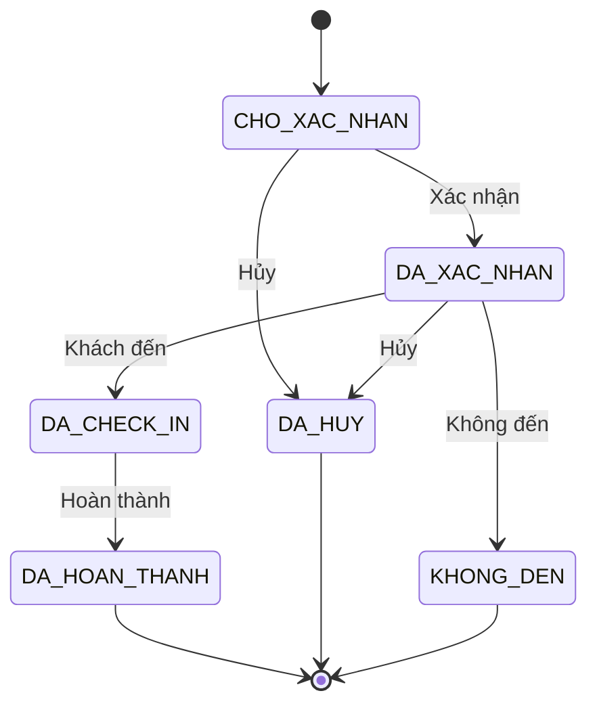

# PHẦN 2 — ĐẶC TẢ KỸ THUẬT HỆ THỐNG QUẢN LÝ NHÀ HÀNG

# 1. Cấu trúc repository hoàn chỉnh

```text
quan-ly-nha-hang/
│
├── giao-dien/
│   ├── public/
│   │
│   ├── src/
│   │   ├── api/
│   │   │   ├── axios.ts
│   │   │   ├── api-xac-thuc.ts
│   │   │   ├── api-khach-hang.ts
│   │   │   ├── api-dat-ban.ts
│   │   │   ├── api-ban-an.ts
│   │   │   ├── api-khu-vuc.ts
│   │   │   ├── api-mon-an.ts
│   │   │   ├── api-danh-muc-mon.ts
│   │   │   ├── api-nhan-vien.ts
│   │   │   ├── api-khuyen-mai.ts
│   │   │   ├── api-danh-gia.ts
│   │   │   ├── api-dashboard.ts
│   │   │   └── api-cau-hinh.ts
│   │   │
│   │   ├── bo-cuc/
│   │   │   ├── bo-cuc-khach-hang.tsx
│   │   │   ├── bo-cuc-quan-tri.tsx
│   │   │   └── bo-cuc-xac-thuc.tsx
│   │   │
│   │   ├── thanh-phan/
│   │   │   ├── dung-chung/
│   │   │   ├── dat-ban/
│   │   │   ├── ban-an/
│   │   │   ├── mon-an/
│   │   │   ├── khach-hang/
│   │   │   └── quan-tri/
│   │   │
│   │   ├── trang/
│   │   │   ├── khach-hang/
│   │   │   │   ├── trang-chu/
│   │   │   │   ├── thuc-don/
│   │   │   │   ├── chi-tiet-mon/
│   │   │   │   ├── dat-ban/
│   │   │   │   ├── dat-ban-thanh-cong/
│   │   │   │   ├── tra-cuu-dat-ban/
│   │   │   │   ├── lich-su-dat-ban/
│   │   │   │   ├── danh-gia/
│   │   │   │   ├── ho-so/
│   │   │   │   └── lien-he/
│   │   │   │
│   │   │   ├── quan-tri/
│   │   │   │   ├── tong-quan/
│   │   │   │   ├── dat-ban/
│   │   │   │   ├── ban-an/
│   │   │   │   ├── khu-vuc/
│   │   │   │   ├── mon-an/
│   │   │   │   ├── danh-muc-mon/
│   │   │   │   ├── khach-hang/
│   │   │   │   ├── nhan-vien/
│   │   │   │   ├── khuyen-mai/
│   │   │   │   ├── danh-gia/
│   │   │   │   ├── tai-khoan/
│   │   │   │   ├── vai-tro/
│   │   │   │   ├── nhat-ky/
│   │   │   │   ├── bao-cao/
│   │   │   │   └── cau-hinh/
│   │   │   │
│   │   │   └── xac-thuc/
│   │   │       ├── dang-nhap/
│   │   │       ├── dang-ky/
│   │   │       ├── quen-mat-khau/
│   │   │       └── dat-lai-mat-khau/
│   │   │
│   │   ├── hooks/
│   │   ├── stores/
│   │   ├── guards/
│   │   ├── dinh-tuyen/
│   │   ├── kieu-du-lieu/
│   │   ├── hang-so/
│   │   ├── tien-ich/
│   │   ├── App.tsx
│   │   └── main.tsx
│   │
│   ├── package.json
│   ├── tsconfig.json
│   └── vite.config.ts
│
├── may-chu/
│   ├── src/
│   │   ├── mo-dun/
│   │   │   ├── xac-thuc/
│   │   │   ├── tai-khoan/
│   │   │   ├── vai-tro/
│   │   │   ├── khach-hang/
│   │   │   ├── nhan-vien/
│   │   │   ├── khu-vuc/
│   │   │   ├── ban-an/
│   │   │   ├── dat-ban/
│   │   │   ├── danh-muc-mon/
│   │   │   ├── mon-an/
│   │   │   ├── khuyen-mai/
│   │   │   ├── danh-gia/
│   │   │   ├── thong-bao/
│   │   │   ├── dashboard/
│   │   │   ├── bao-cao/
│   │   │   ├── cau-hinh/
│   │   │   └── nhat-ky/
│   │   │
│   │   ├── dung-chung/
│   │   │   ├── decorator/
│   │   │   ├── dto/
│   │   │   ├── enum/
│   │   │   ├── exception/
│   │   │   ├── filter/
│   │   │   ├── guard/
│   │   │   ├── interceptor/
│   │   │   ├── middleware/
│   │   │   ├── response/
│   │   │   └── tien-ich/
│   │   │
│   │   ├── co-so-du-lieu/
│   │   │   ├── prisma.service.ts
│   │   │   └── prisma.module.ts
│   │   │
│   │   ├── app.module.ts
│   │   └── main.ts
│   │
│   ├── prisma/
│   │   ├── schema.prisma
│   │   ├── seed.ts
│   │   └── migrations/
│   │
│   ├── test/
│   └── package.json
│
├── co-so-du-lieu/
│   ├── so-do-er.md
│   ├── du-lieu-mau.sql
│   └── sao-luu/
│
├── tai-lieu/
│   ├── 01-phan-tich-nghiep-vu.md
│   ├── 02-actor.md
│   ├── 03-use-case.md
│   ├── 04-bieu-do-lop.md
│   ├── 05-bieu-do-tuan-tu.md
│   ├── 06-bieu-do-hoat-dong.md
│   ├── 07-api.md
│   ├── 08-database.md
│   └── 09-huong-dan-cai-dat.md
│
├── docker-compose.yml
├── .gitignore
└── README.md
```

---

# 2. Nguyên tắc đặt tên

## File

```text
tao-dat-ban.dto.ts
cap-nhat-dat-ban.dto.ts
tim-ban-trong.dto.ts
dat-ban.controller.ts
dat-ban.service.ts
dat-ban.repository.ts
```

## Class

```typescript
DatBanController
DatBanService
DatBanRepository

TaoDatBanDto
CapNhatDatBanDto
TimBanTrongDto
```

## Biến

```typescript
const danhSachBanTrong = [];
const thongTinDatBan = {};
const khachHangHienTai = {};
```

## Hàm

```typescript
timBanTrong()
taoDatBan()
capNhatDatBan()
xacNhanDatBan()
huyDatBan()
checkInDatBan()
hoanThanhDatBan()
```

Không dùng dấu trong tên code.

---

# 3. Schema Prisma/MySQL

```prisma
generator client {
  provider = "prisma-client-js"
}

datasource db {
  provider = "mysql"
  url      = env("DATABASE_URL")
}

enum TrangThaiTaiKhoan {
  HOAT_DONG
  BI_KHOA
  NGUNG_HOAT_DONG
}

enum TrangThaiBan {
  TRONG
  DA_DAT
  DANG_SU_DUNG
  BAO_TRI
  NGUNG_SU_DUNG
}

enum TrangThaiDatBan {
  CHO_XAC_NHAN
  DA_XAC_NHAN
  DA_CHECK_IN
  DA_HOAN_THANH
  DA_HUY
  KHONG_DEN
}

enum NguonDatBan {
  WEBSITE
  DIEN_THOAI
  FACEBOOK
  TRUC_TIEP
  KHAC
}

enum TrangThaiChung {
  HOAT_DONG
  NGUNG_HOAT_DONG
}

model VaiTro {
  id          Int       @id @default(autoincrement())
  maVaiTro    String    @unique @map("ma_vai_tro")
  tenVaiTro   String    @map("ten_vai_tro")
  moTa        String?   @map("mo_ta")
  ngayTao     DateTime  @default(now()) @map("ngay_tao")
  ngayCapNhat DateTime  @updatedAt @map("ngay_cap_nhat")

  taiKhoans   TaiKhoan[]

  @@map("vai_tro")
}

model TaiKhoan {
  id               Int                @id @default(autoincrement())
  tenDangNhap      String?            @unique @map("ten_dang_nhap")
  email            String             @unique
  matKhau          String             @map("mat_khau")
  vaiTroId         Int                @map("vai_tro_id")
  trangThai        TrangThaiTaiKhoan  @default(HOAT_DONG) @map("trang_thai")
  lanDangNhapCuoi  DateTime?          @map("lan_dang_nhap_cuoi")
  ngayTao          DateTime           @default(now()) @map("ngay_tao")
  ngayCapNhat      DateTime           @updatedAt @map("ngay_cap_nhat")

  vaiTro           VaiTro             @relation(fields: [vaiTroId], references: [id])
  khachHang        KhachHang?
  nhanVien         NhanVien?

  @@index([vaiTroId])
  @@map("tai_khoan")
}

model KhachHang {
  id              Int       @id @default(autoincrement())
  taiKhoanId      Int?      @unique @map("tai_khoan_id")
  hoTen           String    @map("ho_ten")
  soDienThoai     String    @unique @map("so_dien_thoai")
  email           String?
  ngaySinh        DateTime? @map("ngay_sinh")
  gioiTinh        String?   @map("gioi_tinh")
  ghiChu          String?   @db.Text @map("ghi_chu")
  daXoa           Boolean   @default(false) @map("da_xoa")
  ngayTao         DateTime  @default(now()) @map("ngay_tao")
  ngayCapNhat     DateTime  @updatedAt @map("ngay_cap_nhat")

  taiKhoan        TaiKhoan? @relation(fields: [taiKhoanId], references: [id])
  datBans         DatBan[]
  danhGias        DanhGia[]

  @@index([soDienThoai])
  @@index([email])
  @@map("khach_hang")
}

model NhanVien {
  id              Int       @id @default(autoincrement())
  taiKhoanId      Int       @unique @map("tai_khoan_id")
  maNhanVien      String    @unique @map("ma_nhan_vien")
  hoTen           String    @map("ho_ten")
  soDienThoai     String?   @map("so_dien_thoai")
  email           String?
  ghiChu          String?   @db.Text @map("ghi_chu")
  daXoa           Boolean   @default(false) @map("da_xoa")
  ngayTao         DateTime  @default(now()) @map("ngay_tao")
  ngayCapNhat     DateTime  @updatedAt @map("ngay_cap_nhat")

  taiKhoan        TaiKhoan  @relation(fields: [taiKhoanId], references: [id])
  datBanXacNhans  DatBan[]  @relation("NguoiXacNhan")
  lichSuDatBans   LichSuDatBan[]
  nhatKys         NhatKyHoatDong[]

  @@map("nhan_vien")
}

model KhuVuc {
  id              Int             @id @default(autoincrement())
  maKhuVuc        String          @unique @map("ma_khu_vuc")
  tenKhuVuc       String          @map("ten_khu_vuc")
  moTa            String?         @db.Text @map("mo_ta")
  thuTu           Int             @default(0) @map("thu_tu")
  trangThai       TrangThaiChung  @default(HOAT_DONG) @map("trang_thai")
  ngayTao         DateTime        @default(now()) @map("ngay_tao")
  ngayCapNhat     DateTime        @updatedAt @map("ngay_cap_nhat")

  banAns          BanAn[]
  datBans         DatBan[]

  @@map("khu_vuc")
}

model BanAn {
  id              Int           @id @default(autoincrement())
  maBan           String        @unique @map("ma_ban")
  tenBan          String        @map("ten_ban")
  khuVucId        Int           @map("khu_vuc_id")
  sucChua         Int           @map("suc_chua")
  sucChuaToiDa    Int           @map("suc_chua_toi_da")
  trangThai       TrangThaiBan  @default(TRONG) @map("trang_thai")
  ghiChu          String?       @db.Text @map("ghi_chu")
  daXoa           Boolean       @default(false) @map("da_xoa")
  ngayTao         DateTime      @default(now()) @map("ngay_tao")
  ngayCapNhat     DateTime      @updatedAt @map("ngay_cap_nhat")

  khuVuc          KhuVuc        @relation(fields: [khuVucId], references: [id])
  chiTietDatBans  ChiTietDatBan[]

  @@index([khuVucId])
  @@index([trangThai])
  @@index([sucChua])
  @@map("ban_an")
}

model DatBan {
  id                  Int                 @id @default(autoincrement())
  maDatBan            String              @unique @map("ma_dat_ban")

  khachHangId         Int?                @map("khach_hang_id")
  khuVucId            Int?                @map("khu_vuc_id")

  hoTen               String              @map("ho_ten")
  soDienThoai         String              @map("so_dien_thoai")
  email               String?

  ngayDat             DateTime            @db.Date @map("ngay_dat")
  gioBatDau           DateTime            @map("gio_bat_dau")
  gioKetThuc          DateTime            @map("gio_ket_thuc")

  soNguoi             Int                 @map("so_nguoi")
  trangThai           TrangThaiDatBan     @default(CHO_XAC_NHAN) @map("trang_thai")
  nguonDat            NguonDatBan         @default(WEBSITE) @map("nguon_dat")

  ghiChuKhach         String?             @db.Text @map("ghi_chu_khach")
  ghiChuNoiBo         String?             @db.Text @map("ghi_chu_noi_bo")

  nguoiXacNhanId      Int?                @map("nguoi_xac_nhan_id")
  thoiGianXacNhan     DateTime?           @map("thoi_gian_xac_nhan")
  thoiGianCheckIn     DateTime?           @map("thoi_gian_check_in")
  thoiGianHoanThanh   DateTime?           @map("thoi_gian_hoan_thanh")

  lyDoHuy             String?             @db.Text @map("ly_do_huy")
  ngayTao             DateTime            @default(now()) @map("ngay_tao")
  ngayCapNhat         DateTime            @updatedAt @map("ngay_cap_nhat")

  khachHang           KhachHang?          @relation(fields: [khachHangId], references: [id])
  khuVuc              KhuVuc?             @relation(fields: [khuVucId], references: [id])
  nguoiXacNhan        NhanVien?           @relation("NguoiXacNhan", fields: [nguoiXacNhanId], references: [id])

  chiTietDatBans      ChiTietDatBan[]
  lichSuDatBans       LichSuDatBan[]

  @@index([maDatBan])
  @@index([soDienThoai])
  @@index([ngayDat])
  @@index([trangThai])
  @@index([khachHangId])
  @@index([khuVucId])
  @@map("dat_ban")
}

model ChiTietDatBan {
  id          Int      @id @default(autoincrement())
  datBanId    Int      @map("dat_ban_id")
  banAnId     Int      @map("ban_an_id")
  ngayTao     DateTime @default(now()) @map("ngay_tao")

  datBan      DatBan   @relation(fields: [datBanId], references: [id])
  banAn       BanAn    @relation(fields: [banAnId], references: [id])

  @@unique([datBanId, banAnId])
  @@index([banAnId])
  @@map("chi_tiet_dat_ban")
}

model LichSuDatBan {
  id                  Int                @id @default(autoincrement())
  datBanId            Int                @map("dat_ban_id")
  trangThaiCu         TrangThaiDatBan?   @map("trang_thai_cu")
  trangThaiMoi        TrangThaiDatBan    @map("trang_thai_moi")
  nguoiThucHienId     Int?               @map("nguoi_thuc_hien_id")
  ghiChu              String?            @db.Text @map("ghi_chu")
  thoiGian            DateTime           @default(now()) @map("thoi_gian")

  datBan              DatBan             @relation(fields: [datBanId], references: [id])
  nguoiThucHien       NhanVien?          @relation(fields: [nguoiThucHienId], references: [id])

  @@index([datBanId])
  @@map("lich_su_dat_ban")
}

model DanhMucMon {
  id              Int             @id @default(autoincrement())
  tenDanhMuc      String          @map("ten_danh_muc")
  duongDan        String          @unique @map("duong_dan")
  moTa            String?         @db.Text @map("mo_ta")
  hinhAnh         String?         @map("hinh_anh")
  thuTu           Int             @default(0) @map("thu_tu")
  trangThai       TrangThaiChung  @default(HOAT_DONG) @map("trang_thai")
  ngayTao         DateTime        @default(now()) @map("ngay_tao")
  ngayCapNhat     DateTime        @updatedAt @map("ngay_cap_nhat")

  monAns          MonAn[]

  @@map("danh_muc_mon")
}

model MonAn {
  id              Int             @id @default(autoincrement())
  maMon           String          @unique @map("ma_mon")
  danhMucId       Int             @map("danh_muc_id")
  tenMon          String          @map("ten_mon")
  duongDan        String          @unique @map("duong_dan")
  moTa            String?         @db.Text @map("mo_ta")
  gia             Decimal         @db.Decimal(12, 2)
  giaKhuyenMai    Decimal?        @db.Decimal(12, 2) @map("gia_khuyen_mai")
  hinhAnh         String?         @map("hinh_anh")
  laMonNoiBat     Boolean         @default(false) @map("la_mon_noi_bat")
  conMon          Boolean         @default(true) @map("con_mon")
  trangThai       TrangThaiChung  @default(HOAT_DONG) @map("trang_thai")
  daXoa           Boolean         @default(false) @map("da_xoa")
  ngayTao         DateTime        @default(now()) @map("ngay_tao")
  ngayCapNhat     DateTime        @updatedAt @map("ngay_cap_nhat")

  danhMuc         DanhMucMon      @relation(fields: [danhMucId], references: [id])

  @@index([danhMucId])
  @@index([tenMon])
  @@map("mon_an")
}

model KhuyenMai {
  id                Int             @id @default(autoincrement())
  maKhuyenMai       String          @unique @map("ma_khuyen_mai")
  tenKhuyenMai      String          @map("ten_khuyen_mai")
  moTa              String?         @db.Text @map("mo_ta")
  loaiGiam          String          @map("loai_giam")
  giaTri            Decimal         @db.Decimal(12, 2) @map("gia_tri")
  ngayBatDau        DateTime        @map("ngay_bat_dau")
  ngayKetThuc       DateTime        @map("ngay_ket_thuc")
  soLuotToiDa       Int?            @map("so_luot_toi_da")
  soLuotDaDung      Int             @default(0) @map("so_luot_da_dung")
  trangThai         TrangThaiChung  @default(HOAT_DONG) @map("trang_thai")
  ngayTao           DateTime        @default(now()) @map("ngay_tao")
  ngayCapNhat       DateTime        @updatedAt @map("ngay_cap_nhat")

  @@index([maKhuyenMai])
  @@map("khuyen_mai")
}

model DanhGia {
  id                Int             @id @default(autoincrement())
  khachHangId       Int             @map("khach_hang_id")
  soSao             Int             @map("so_sao")
  noiDung           String?         @db.Text @map("noi_dung")
  phanHoi           String?         @db.Text @map("phan_hoi")
  hienThi           Boolean         @default(true) @map("hien_thi")
  ngayTao           DateTime        @default(now()) @map("ngay_tao")
  ngayCapNhat       DateTime        @updatedAt @map("ngay_cap_nhat")

  khachHang         KhachHang       @relation(fields: [khachHangId], references: [id])

  @@index([khachHangId])
  @@map("danh_gia")
}

model CauHinh {
  id          Int       @id @default(autoincrement())
  khoa        String    @unique
  giaTri      String    @db.Text @map("gia_tri")
  moTa        String?   @db.Text @map("mo_ta")
  ngayCapNhat DateTime  @updatedAt @map("ngay_cap_nhat")

  @@map("cau_hinh")
}

model NhatKyHoatDong {
  id               Int       @id @default(autoincrement())
  nhanVienId       Int?      @map("nhan_vien_id")
  hanhDong         String    @map("hanh_dong")
  doiTuong         String    @map("doi_tuong")
  doiTuongId       String?   @map("doi_tuong_id")
  duLieuCu         Json?     @map("du_lieu_cu")
  duLieuMoi        Json?     @map("du_lieu_moi")
  diaChiIp         String?   @map("dia_chi_ip")
  thoiGian         DateTime  @default(now()) @map("thoi_gian")

  nhanVien         NhanVien? @relation(fields: [nhanVienId], references: [id])

  @@index([nhanVienId])
  @@index([doiTuong])
  @@index([thoiGian])
  @@map("nhat_ky_hoat_dong")
}
```

---

# 4. Một lưu ý cực kỳ quan trọng về trạng thái bàn

Không được suy luận:

```text
BAN_AN.trangThai = DA_DAT
```

là đủ để xác định bàn có trống vào ngày mai hay không.

Ví dụ:

```text
Bàn A01

Hôm nay 18:00:
có khách

Ngày mai 18:00:
không có khách
```

Trạng thái hiện tại của bàn và tình trạng khả dụng theo lịch là hai khái niệm khác nhau.

`ban_an.trang_thai` chỉ nên biểu diễn trạng thái vận hành tức thời:

```text
TRONG
DANG_SU_DUNG
BAO_TRI
NGUNG_SU_DUNG
```

Còn việc bàn có được đặt vào một thời điểm cụ thể hay không phải kiểm tra:

```text
dat_ban
+
chi_tiet_dat_ban
```

---

# 5. Logic xác định trùng lịch

Booking A:

```text
18:00 → 20:00
```

Booking B:

```text
19:00 → 21:00
```

Trùng.

Điều kiện:

```typescript
gioBatDauMoi < gioKetThucCu &&
gioKetThucMoi > gioBatDauCu
```

SQL tương đương:

```sql
WHERE gio_bat_dau < :gioKetThucMoi
AND gio_ket_thuc > :gioBatDauMoi
```

Chỉ xét booking có trạng thái:

```text
CHO_XAC_NHAN
DA_XAC_NHAN
DA_CHECK_IN
```

Không xét:

```text
DA_HUY
KHONG_DEN
DA_HOAN_THANH
```

với khoảng thời gian tương lai.

---

# 6. Quy tắc ghép bàn

Ví dụ khách đặt:

```text
9 người
```

Bàn:

```text
A01: 4 người
A02: 4 người
A03: 2 người
```

Hệ thống có thể đề xuất:

```text
A01 + A02 + A03
```

tổng sức chứa:

```text
10 người
```

Không nên tự động ghép mọi bàn trong hệ thống.

Mỗi bàn nên có thêm logic:

```text
có thể ghép với bàn nào
```

Version 2 có thể thêm bảng:

```text
lien_ket_ban
```

```text
id
ban_1_id
ban_2_id
co_the_ghep
```

Để tránh đề xuất ghép hai bàn nằm ở hai đầu nhà hàng.

---

# 7. Chuẩn API

Base URL:

```text
/api/v1
```

Swagger:

```text
/api/tai-lieu
```

Ví dụ:

```text
GET /api/v1/mon-an
POST /api/v1/dat-ban
GET /api/v1/quan-tri/dat-ban
```

---

# 8. Chuẩn response

## Thành công

```json
{
  "thanhCong": true,
  "thongBao": "Thao tác thành công",
  "duLieu": {}
}
```

## Danh sách

```json
{
  "thanhCong": true,
  "thongBao": "Lấy danh sách thành công",
  "duLieu": [],
  "phanTrang": {
    "trang": 1,
    "kichThuoc": 20,
    "tongBanGhi": 154,
    "tongTrang": 8
  }
}
```

## Lỗi

```json
{
  "thanhCong": false,
  "maLoi": "BAN_KHONG_CON_TRONG",
  "thongBao": "Bàn vừa được khách khác đặt.",
  "loi": []
}
```

---

# 9. HTTP Status

```text
200 OK
201 Created
204 No Content

400 Bad Request
401 Unauthorized
403 Forbidden
404 Not Found
409 Conflict
422 Unprocessable Entity
429 Too Many Requests

500 Internal Server Error
```

Ví dụ double booking nên trả:

```text
409 Conflict
```

với:

```json
{
  "thanhCong": false,
  "maLoi": "BAN_KHONG_CON_TRONG",
  "thongBao": "Bàn đã được khách khác đặt trong khoảng thời gian này."
}
```

---

# 10. Danh sách API Public

## Nhà hàng

```http
GET /api/v1/thong-tin-nha-hang
```

## Danh mục

```http
GET /api/v1/danh-muc-mon
GET /api/v1/danh-muc-mon/:duongDan
```

## Món ăn

```http
GET /api/v1/mon-an
GET /api/v1/mon-an/noi-bat
GET /api/v1/mon-an/:duongDan
```

Query:

```text
?trang=1
&kichThuoc=12
&danhMucId=2
&tuKhoa=bo
&sapXep=gia-tang
```

---

# 11. API xác thực

```http
POST /api/v1/xac-thuc/dang-ky
POST /api/v1/xac-thuc/dang-nhap
POST /api/v1/xac-thuc/lam-moi-token
POST /api/v1/xac-thuc/dang-xuat
POST /api/v1/xac-thuc/quen-mat-khau
POST /api/v1/xac-thuc/dat-lai-mat-khau
GET  /api/v1/xac-thuc/thong-tin-hien-tai
```

---

# 12. API kiểm tra bàn

```http
GET /api/v1/ban-an/tim-ban-trong
```

Query:

```text
ngay=2026-08-20
gioBatDau=19:00
soNguoi=4
khuVucId=1
```

Response:

```json
{
  "thanhCong": true,
  "duLieu": {
    "ngay": "2026-08-20",
    "gioBatDau": "19:00",
    "gioKetThuc": "21:00",
    "soNguoi": 4,
    "danhSachBan": [
      {
        "id": 5,
        "maBan": "A05",
        "tenBan": "Bàn A05",
        "sucChua": 4,
        "sucChuaToiDa": 5,
        "khuVuc": {
          "id": 1,
          "tenKhuVuc": "Trong nhà"
        }
      }
    ]
  }
}
```

---

# 13. API đặt bàn public

```http
POST /api/v1/dat-ban
```

Request:

```json
{
  "hoTen": "Nguyễn Văn A",
  "soDienThoai": "0909123456",
  "email": "a@gmail.com",
  "ngay": "2026-08-20",
  "gioBatDau": "19:00",
  "soNguoi": 4,
  "khuVucId": 1,
  "banAnIds": [5],
  "ghiChu": "Cho bàn gần cửa sổ"
}
```

Response:

```json
{
  "thanhCong": true,
  "thongBao": "Đặt bàn thành công",
  "duLieu": {
    "maDatBan": "DB202608200001",
    "trangThai": "CHO_XAC_NHAN",
    "ngay": "2026-08-20",
    "gioBatDau": "19:00",
    "gioKetThuc": "21:00"
  }
}
```

---

# 14. API tra cứu đặt bàn

```http
POST /api/v1/dat-ban/tra-cuu
```

Request:

```json
{
  "maDatBan": "DB202608200001",
  "soDienThoai": "0909123456"
}
```

---

# 15. API khách hàng đăng nhập

```http
GET   /api/v1/khach-hang/ho-so
PATCH /api/v1/khach-hang/ho-so

GET   /api/v1/khach-hang/dat-ban
GET   /api/v1/khach-hang/dat-ban/:id

PATCH /api/v1/khach-hang/dat-ban/:id/huy

GET   /api/v1/khach-hang/danh-gia
POST  /api/v1/khach-hang/danh-gia
PATCH /api/v1/khach-hang/danh-gia/:id
DELETE /api/v1/khach-hang/danh-gia/:id
```

---

# 16. API Admin Dashboard

```http
GET /api/v1/quan-tri/dashboard/tong-quan
GET /api/v1/quan-tri/dashboard/dat-ban-7-ngay
GET /api/v1/quan-tri/dashboard/dat-ban-theo-thang
GET /api/v1/quan-tri/dashboard/khach-theo-khung-gio
GET /api/v1/quan-tri/dashboard/trang-thai-ban
```

---

# 17. API Admin đặt bàn

```http
GET   /api/v1/quan-tri/dat-ban
POST  /api/v1/quan-tri/dat-ban
GET   /api/v1/quan-tri/dat-ban/:id
PATCH /api/v1/quan-tri/dat-ban/:id

PATCH /api/v1/quan-tri/dat-ban/:id/xac-nhan
PATCH /api/v1/quan-tri/dat-ban/:id/sap-ban
PATCH /api/v1/quan-tri/dat-ban/:id/check-in
PATCH /api/v1/quan-tri/dat-ban/:id/hoan-thanh
PATCH /api/v1/quan-tri/dat-ban/:id/huy
PATCH /api/v1/quan-tri/dat-ban/:id/khong-den

GET /api/v1/quan-tri/dat-ban/:id/lich-su
```

---

# 18. API khu vực

```http
GET    /api/v1/quan-tri/khu-vuc
POST   /api/v1/quan-tri/khu-vuc
GET    /api/v1/quan-tri/khu-vuc/:id
PATCH  /api/v1/quan-tri/khu-vuc/:id
DELETE /api/v1/quan-tri/khu-vuc/:id
```

---

# 19. API bàn ăn

```http
GET    /api/v1/quan-tri/ban-an
POST   /api/v1/quan-tri/ban-an
GET    /api/v1/quan-tri/ban-an/:id
PATCH  /api/v1/quan-tri/ban-an/:id
DELETE /api/v1/quan-tri/ban-an/:id

GET /api/v1/quan-tri/ban-an/so-do
```

---

# 20. API danh mục

```http
GET    /api/v1/quan-tri/danh-muc-mon
POST   /api/v1/quan-tri/danh-muc-mon
GET    /api/v1/quan-tri/danh-muc-mon/:id
PATCH  /api/v1/quan-tri/danh-muc-mon/:id
DELETE /api/v1/quan-tri/danh-muc-mon/:id
```

---

# 21. API món ăn

```http
GET    /api/v1/quan-tri/mon-an
POST   /api/v1/quan-tri/mon-an
GET    /api/v1/quan-tri/mon-an/:id
PATCH  /api/v1/quan-tri/mon-an/:id
DELETE /api/v1/quan-tri/mon-an/:id

PATCH /api/v1/quan-tri/mon-an/:id/trang-thai
PATCH /api/v1/quan-tri/mon-an/:id/con-mon
PATCH /api/v1/quan-tri/mon-an/:id/noi-bat
```

---

# 22. API khách hàng Admin

```http
GET   /api/v1/quan-tri/khach-hang
GET   /api/v1/quan-tri/khach-hang/:id
PATCH /api/v1/quan-tri/khach-hang/:id
PATCH /api/v1/quan-tri/khach-hang/:id/khoa
PATCH /api/v1/quan-tri/khach-hang/:id/mo-khoa

GET /api/v1/quan-tri/khach-hang/:id/lich-su-dat-ban
```

---

# 23. API nhân viên

```http
GET    /api/v1/quan-tri/nhan-vien
POST   /api/v1/quan-tri/nhan-vien
GET    /api/v1/quan-tri/nhan-vien/:id
PATCH  /api/v1/quan-tri/nhan-vien/:id
DELETE /api/v1/quan-tri/nhan-vien/:id

PATCH /api/v1/quan-tri/nhan-vien/:id/khoa
PATCH /api/v1/quan-tri/nhan-vien/:id/mo-khoa
```

---

# 24. API khuyến mãi

```http
GET    /api/v1/quan-tri/khuyen-mai
POST   /api/v1/quan-tri/khuyen-mai
GET    /api/v1/quan-tri/khuyen-mai/:id
PATCH  /api/v1/quan-tri/khuyen-mai/:id
DELETE /api/v1/quan-tri/khuyen-mai/:id
```

---

# 25. API đánh giá Admin

```http
GET   /api/v1/quan-tri/danh-gia
GET   /api/v1/quan-tri/danh-gia/:id

PATCH /api/v1/quan-tri/danh-gia/:id/hien
PATCH /api/v1/quan-tri/danh-gia/:id/an
PATCH /api/v1/quan-tri/danh-gia/:id/phan-hoi
```

---

# 26. API báo cáo

```http
GET /api/v1/quan-tri/bao-cao/dat-ban
GET /api/v1/quan-tri/bao-cao/khach-hang
GET /api/v1/quan-tri/bao-cao/ban-an
GET /api/v1/quan-tri/bao-cao/khung-gio
GET /api/v1/quan-tri/bao-cao/huy-ban
GET /api/v1/quan-tri/bao-cao/khong-den
```

---

# 27. API cấu hình

```http
GET   /api/v1/quan-tri/cau-hinh
PATCH /api/v1/quan-tri/cau-hinh
```

---

# 28. API nhật ký

```http
GET /api/v1/quan-tri/nhat-ky
GET /api/v1/quan-tri/nhat-ky/:id
```

Không cho Admin sửa hoặc xóa nhật ký qua giao diện bình thường.

---

# 29. Danh sách Use Case

## Khách hàng

```text
UC-KH-01 Xem trang chủ
UC-KH-02 Xem thực đơn
UC-KH-03 Xem chi tiết món
UC-KH-04 Tìm kiếm món
UC-KH-05 Kiểm tra bàn trống
UC-KH-06 Đặt bàn
UC-KH-07 Tra cứu đặt bàn
UC-KH-08 Đăng ký
UC-KH-09 Đăng nhập
UC-KH-10 Quản lý hồ sơ
UC-KH-11 Xem lịch sử đặt bàn
UC-KH-12 Xem chi tiết đặt bàn
UC-KH-13 Hủy đặt bàn
UC-KH-14 Đánh giá nhà hàng
UC-KH-15 Đăng xuất
```

## Nhân viên/Admin

```text
UC-AD-01 Đăng nhập quản trị
UC-AD-02 Xem Dashboard
UC-AD-03 Xem danh sách đặt bàn
UC-AD-04 Xem chi tiết đặt bàn
UC-AD-05 Tạo đặt bàn
UC-AD-06 Cập nhật đặt bàn
UC-AD-07 Xác nhận đặt bàn
UC-AD-08 Sắp bàn
UC-AD-09 Check-in
UC-AD-10 Hoàn thành đặt bàn
UC-AD-11 Hủy đặt bàn
UC-AD-12 Đánh dấu khách không đến

UC-AD-13 Quản lý khu vực
UC-AD-14 Quản lý bàn
UC-AD-15 Quản lý danh mục món
UC-AD-16 Quản lý món
UC-AD-17 Quản lý khách hàng
UC-AD-18 Quản lý nhân viên
UC-AD-19 Quản lý khuyến mãi
UC-AD-20 Quản lý đánh giá
UC-AD-21 Xem báo cáo
UC-AD-22 Quản lý tài khoản
UC-AD-23 Phân quyền
UC-AD-24 Xem nhật ký
UC-AD-25 Cấu hình hệ thống
```

---

# 30. Đặc tả UC-KH-05 — Kiểm tra bàn trống

## Tên Use Case

Kiểm tra bàn trống.

## Actor

Khách hàng.

## Tiền điều kiện

Không yêu cầu đăng nhập.

## Dữ liệu đầu vào

```text
Ngày
Giờ bắt đầu
Số người
Khu vực tùy chọn
```

## Luồng chính

1. Khách mở trang đặt bàn.
2. Khách chọn ngày.
3. Khách chọn giờ.
4. Khách nhập số người.
5. Khách có thể chọn khu vực.
6. Frontend kiểm tra dữ liệu.
7. Frontend gửi yêu cầu API.
8. Backend kiểm tra giờ mở cửa.
9. Backend tính giờ kết thúc.
10. Backend tìm bàn đủ sức chứa.
11. Backend loại các bàn bị trùng lịch.
12. Backend trả danh sách bàn trống.
13. Frontend hiển thị bàn phù hợp.

## Luồng ngoại lệ

### E01 — Ngày không hợp lệ

```text
Ngày đặt đã qua.
```

### E02 — Ngoài giờ mở cửa

```text
Khung giờ đã chọn nằm ngoài giờ phục vụ.
```

### E03 — Quá gần giờ hiện tại

```text
Không đủ thời gian đặt trước tối thiểu.
```

### E04 — Không còn bàn

```text
Không còn bàn phù hợp với số người và thời gian đã chọn.
```

## Hậu điều kiện

Không thay đổi database.

---

# 31. Đặc tả UC-KH-06 — Đặt bàn

## Actor

Khách hàng.

## Tiền điều kiện

Khách đã nhập đầy đủ:

```text
Ngày
Giờ
Số người
Thông tin liên hệ
```

## Luồng chính

1. Khách chọn ngày.
2. Khách chọn giờ.
3. Khách nhập số người.
4. Hệ thống tìm bàn phù hợp.
5. Khách chọn bàn hoặc để hệ thống tự sắp.
6. Khách nhập họ tên.
7. Khách nhập số điện thoại.
8. Khách nhập email nếu có.
9. Khách nhập ghi chú.
10. Khách nhấn Đặt bàn.
11. Backend validate request.
12. Backend kiểm tra giờ mở cửa.
13. Backend kiểm tra quy tắc đặt trước.
14. Backend kiểm tra sức chứa.
15. Backend kiểm tra trùng lịch lần cuối.
16. Backend bắt đầu transaction.
17. Backend tạo `dat_ban`.
18. Backend tạo `chi_tiet_dat_ban`.
19. Backend tạo `lich_su_dat_ban`.
20. Backend commit transaction.
21. Hệ thống sinh mã đặt bàn.
22. Hệ thống trả kết quả.
23. Frontend hiển thị trang thành công.

## Hậu điều kiện

Tồn tại booking:

```text
CHO_XAC_NHAN
```

## Ngoại lệ

### E01 — Bàn vừa bị người khác đặt

Rollback.

Trả:

```text
BAN_KHONG_CON_TRONG
```

### E02 — Số người vượt sức chứa

```text
VUOT_SUC_CHUA
```

### E03 — Nhà hàng ngừng nhận đặt

```text
TAM_NGUNG_NHAN_DAT_BAN
```

### E04 — Dữ liệu không hợp lệ

Không tạo booking.

---

# 32. Đặc tả UC-KH-13 — Hủy đặt bàn

## Actor

Khách hàng.

## Tiền điều kiện

Khách sở hữu booking.

Booking:

```text
CHO_XAC_NHAN
```

hoặc:

```text
DA_XAC_NHAN
```

## Luồng chính

1. Khách mở lịch sử đặt bàn.
2. Chọn booking.
3. Nhấn Hủy.
4. Hệ thống hiển thị xác nhận.
5. Khách nhập lý do.
6. Backend kiểm tra quyền.
7. Backend kiểm tra trạng thái.
8. Backend kiểm tra thời gian.
9. Backend cập nhật:

```text
DA_HUY
```

10. Backend ghi lịch sử.
11. Frontend thông báo thành công.

## Ngoại lệ

Không cho hủy:

```text
DA_CHECK_IN
DA_HOAN_THANH
DA_HUY
KHONG_DEN
```

---

# 33. Đặc tả UC-AD-05 — Admin tạo đặt bàn

## Actor

Nhân viên/Admin.

## Mục đích

Tạo booking cho khách:

```text
Điện thoại
Facebook
Trực tiếp
```

## Luồng

1. Nhân viên mở Tạo đặt bàn.
2. Nhập số điện thoại.
3. Hệ thống tìm khách đã tồn tại.
4. Nếu có, tự điền thông tin.
5. Nếu chưa có, nhập khách mới.
6. Chọn ngày.
7. Chọn giờ.
8. Chọn số người.
9. Chọn khu vực.
10. Hệ thống tìm bàn.
11. Nhân viên chọn bàn.
12. Nhập nguồn đặt.
13. Nhập ghi chú.
14. Nhấn tạo.
15. Backend kiểm tra trùng.
16. Tạo booking.
17. Có thể đặt trạng thái ngay:

```text
DA_XAC_NHAN
```

nếu nhân viên đã xác nhận trực tiếp với khách.

---

# 34. Đặc tả UC-AD-07 — Xác nhận đặt bàn

## Actor

Nhân viên/Admin.

## Tiền điều kiện

Booking:

```text
CHO_XAC_NHAN
```

## Luồng

1. Mở chi tiết booking.
2. Kiểm tra thông tin.
3. Nhấn Xác nhận.
4. Backend kiểm tra booking.
5. Backend kiểm tra bàn vẫn hợp lệ.
6. Backend cập nhật:

```text
DA_XAC_NHAN
```

7. Lưu:

```text
nguoi_xac_nhan_id
thoi_gian_xac_nhan
```

8. Tạo lịch sử.
9. Gửi thông báo cho khách.

---

# 35. Đặc tả UC-AD-09 — Check-in

## Actor

Nhân viên/Admin.

## Tiền điều kiện

Booking:

```text
DA_XAC_NHAN
```

## Luồng

1. Khách tới nhà hàng.
2. Nhân viên tìm booking.
3. Kiểm tra mã hoặc số điện thoại.
4. Nhấn Check-in.
5. Hệ thống kiểm tra trạng thái.
6. Cập nhật:

```text
DA_CHECK_IN
```

7. Lưu:

```text
thoi_gian_check_in
```

8. Các bàn thuộc booking chuyển trạng thái vận hành:

```text
DANG_SU_DUNG
```

9. Ghi lịch sử.

---

# 36. Đặc tả UC-AD-10 — Hoàn thành

## Tiền điều kiện

Booking:

```text
DA_CHECK_IN
```

## Luồng

1. Khách rời bàn.
2. Nhân viên chọn Hoàn thành.
3. Backend cập nhật:

```text
DA_HOAN_THANH
```

4. Lưu:

```text
thoi_gian_hoan_thanh
```

5. Bàn chuyển trạng thái:

```text
TRONG
```

6. Tạo lịch sử.

---

# 37. Đặc tả UC-AD-12 — Khách không đến

Booking đã xác nhận nhưng khách không tới.

## Luồng

1. Booking quá thời gian chờ.
2. Nhân viên mở booking.
3. Nhấn Không đến.
4. Backend kiểm tra trạng thái.
5. Backend cập nhật:

```text
KHONG_DEN
```

6. Giải phóng bàn.
7. Ghi lịch sử.

Có thể cấu hình:

```text
thoi_gian_cho_khach = 15 phút
```

---

# 38. State Machine đặt bàn



Không cho:

```text
DA_HUY → DA_XAC_NHAN

DA_HOAN_THANH → DA_CHECK_IN

KHONG_DEN → DA_CHECK_IN
```

Nếu cần khôi phục booking bị hủy, nên có nghiệp vụ riêng và ghi audit log.

---

# 39. Phân quyền API

## Public

```text
Trang chủ
Thực đơn
Tìm bàn
Tạo booking
Tra cứu booking
Đăng ký
Đăng nhập
```

## KHACH_HANG

```text
Hồ sơ
Lịch sử booking
Hủy booking
Đánh giá
```

## NHAN_VIEN

```text
Đặt bàn
Xác nhận
Sắp bàn
Check-in
Hoàn thành
Không đến
Bàn
Khách hàng cơ bản
```

## QUAN_TRI_VIEN

Toàn bộ hệ thống.

---

# 40. Guard

```typescript
@UseGuards(JwtAuthGuard, VaiTroGuard)
@VaiTro('QUAN_TRI_VIEN')
```

hoặc:

```typescript
@VaiTro('NHAN_VIEN', 'QUAN_TRI_VIEN')
```

---

# 41. Cấu trúc module đặt bàn Backend

```text
dat-ban/
│
├── dto/
│   ├── tao-dat-ban.dto.ts
│   ├── cap-nhat-dat-ban.dto.ts
│   ├── tim-dat-ban.dto.ts
│   ├── huy-dat-ban.dto.ts
│   ├── sap-ban.dto.ts
│   └── tra-cuu-dat-ban.dto.ts
│
├── dat-ban.controller.ts
├── dat-ban-quan-tri.controller.ts
├── dat-ban.service.ts
├── dat-ban.repository.ts
├── dat-ban.mapper.ts
├── dat-ban.module.ts
└── dat-ban.constant.ts
```

---

# 42. Service đặt bàn

```typescript
@Injectable()
export class DatBanService {
  constructor(
    private readonly datBanRepository: DatBanRepository,
    private readonly banAnService: BanAnService,
    private readonly prisma: PrismaService,
  ) {}

  async taoDatBan(duLieu: TaoDatBanDto) {
    const khoangThoiGian =
      this.tinhKhoangThoiGianDatBan(duLieu);

    await this.kiemTraQuyTacDatBan(
      duLieu,
      khoangThoiGian,
    );

    const danhSachBan =
      await this.banAnService.kiemTraDanhSachBanTrong({
        banAnIds: duLieu.banAnIds,
        gioBatDau: khoangThoiGian.gioBatDau,
        gioKetThuc: khoangThoiGian.gioKetThuc,
      });

    if (!danhSachBan.hopLe) {
      throw new ConflictException({
        maLoi: 'BAN_KHONG_CON_TRONG',
        thongBao:
          'Một hoặc nhiều bàn vừa được khách khác đặt.',
      });
    }

    return this.prisma.$transaction(async (giaoDich) => {
      const maDatBan =
        await this.taoMaDatBan(giaoDich);

      const datBan =
        await this.datBanRepository.taoDatBan(
          giaoDich,
          {
            ...duLieu,
            maDatBan,
            ...khoangThoiGian,
          },
        );

      await this.datBanRepository.ganBan(
        giaoDich,
        datBan.id,
        duLieu.banAnIds,
      );

      await this.datBanRepository.taoLichSu(
        giaoDich,
        {
          datBanId: datBan.id,
          trangThaiMoi: 'CHO_XAC_NHAN',
        },
      );

      return datBan;
    });
  }
}
```

---

# 43. Repository

```typescript
@Injectable()
export class DatBanRepository {
  async timDatBanTrungLich(
    prisma: PrismaService,
    banAnId: number,
    gioBatDau: Date,
    gioKetThuc: Date,
  ) {
    return prisma.chiTietDatBan.findFirst({
      where: {
        banAnId,

        datBan: {
          trangThai: {
            in: [
              'CHO_XAC_NHAN',
              'DA_XAC_NHAN',
              'DA_CHECK_IN',
            ],
          },

          gioBatDau: {
            lt: gioKetThuc,
          },

          gioKetThuc: {
            gt: gioBatDau,
          },
        },
      },
    });
  }
}
```

---

# 44. DTO tạo đặt bàn

```typescript
export class TaoDatBanDto {
  @ApiProperty({
    example: 'Nguyễn Văn A',
  })
  @IsString()
  @IsNotEmpty()
  hoTen: string;

  @ApiProperty({
    example: '0909123456',
  })
  @IsString()
  @IsNotEmpty()
  soDienThoai: string;

  @ApiPropertyOptional({
    example: 'a@gmail.com',
  })
  @IsOptional()
  @IsEmail()
  email?: string;

  @ApiProperty({
    example: '2026-08-20',
  })
  @IsDateString()
  ngay: string;

  @ApiProperty({
    example: '19:00',
  })
  @IsString()
  gioBatDau: string;

  @ApiProperty({
    example: 4,
  })
  @Type(() => Number)
  @IsInt()
  @Min(1)
  soNguoi: number;

  @ApiPropertyOptional({
    example: 1,
  })
  @IsOptional()
  @Type(() => Number)
  @IsInt()
  khuVucId?: number;

  @ApiProperty({
    example: [5],
  })
  @IsArray()
  @ArrayMinSize(1)
  @IsInt({
    each: true,
  })
  banAnIds: number[];

  @ApiPropertyOptional({
    example: 'Cho bàn gần cửa sổ',
  })
  @IsOptional()
  @IsString()
  ghiChu?: string;
}
```

---

# 45. Swagger Controller

```typescript
@ApiTags('Khách hàng - Đặt bàn')
@Controller('api/v1/dat-ban')
export class DatBanController {
  constructor(
    private readonly datBanService: DatBanService,
  ) {}

  @Post()
  @HttpCode(HttpStatus.CREATED)
  @ApiOperation({
    summary: 'Khách hàng tạo đặt bàn',
  })
  @ApiResponse({
    status: 201,
    description: 'Đặt bàn thành công',
  })
  @ApiResponse({
    status: 409,
    description: 'Bàn không còn trống',
  })
  async taoDatBan(
    @Body() duLieu: TaoDatBanDto,
  ) {
    const ketQua =
      await this.datBanService.taoDatBan(duLieu);

    return {
      thanhCong: true,
      thongBao: 'Đặt bàn thành công',
      duLieu: ketQua,
    };
  }
}
```

---

# 46. Axios Frontend

```typescript
import axios from 'axios';

export const api = axios.create({
  baseURL:
    import.meta.env.VITE_API_URL ||
    'http://localhost:8080/api/v1',

  timeout: 15000,

  headers: {
    'Content-Type': 'application/json',
  },
});
```

---

# 47. API đặt bàn Frontend

```typescript
import { api } from './axios';

export interface DuLieuTaoDatBan {
  hoTen: string;
  soDienThoai: string;
  email?: string;
  ngay: string;
  gioBatDau: string;
  soNguoi: number;
  khuVucId?: number;
  banAnIds: number[];
  ghiChu?: string;
}

export async function taoDatBan(
  duLieu: DuLieuTaoDatBan,
) {
  const response =
    await api.post('/dat-ban', duLieu);

  return response.data;
}
```

---

# 48. React Query

```typescript
export function useTaoDatBan() {
  return useMutation({
    mutationFn: taoDatBan,

    onSuccess: () => {
      message.success(
        'Đặt bàn thành công',
      );
    },

    onError: (error) => {
      message.error(
        layThongBaoLoi(error),
      );
    },
  });
}
```

---

# 49. Route khách hàng

```text
/
 /thuc-don
 /mon-an/:duongDan

 /dat-ban
 /dat-ban/thanh-cong/:maDatBan
 /tra-cuu-dat-ban

 /dang-nhap
 /dang-ky
 /quen-mat-khau

 /tai-khoan
 /tai-khoan/ho-so
 /tai-khoan/dat-ban
 /tai-khoan/dat-ban/:id
 /tai-khoan/danh-gia
```

---

# 50. Route Admin

```text
/quan-tri

/quan-tri/tong-quan

/quan-tri/dat-ban
/quan-tri/dat-ban/tao-moi
/quan-tri/dat-ban/:id

/quan-tri/khu-vuc

/quan-tri/ban-an

/quan-tri/danh-muc-mon

/quan-tri/mon-an

/quan-tri/khach-hang

/quan-tri/nhan-vien

/quan-tri/khuyen-mai

/quan-tri/danh-gia

/quan-tri/bao-cao

/quan-tri/tai-khoan

/quan-tri/vai-tro

/quan-tri/nhat-ky

/quan-tri/cau-hinh
```

---

# 51. Các màn hình FE cần làm

## Khách hàng

```text
KH01 Trang chủ

KH02 Thực đơn

KH03 Chi tiết món

KH04 Đặt bàn

KH05 Chọn bàn

KH06 Đặt bàn thành công

KH07 Tra cứu đặt bàn

KH08 Đăng nhập

KH09 Đăng ký

KH10 Hồ sơ

KH11 Lịch sử đặt bàn

KH12 Chi tiết đặt bàn

KH13 Đánh giá
```

## Admin

```text
AD01 Đăng nhập

AD02 Dashboard

AD03 Danh sách đặt bàn

AD04 Chi tiết đặt bàn

AD05 Tạo đặt bàn

AD06 Sơ đồ bàn

AD07 Khu vực

AD08 Danh sách món

AD09 Form món

AD10 Danh mục

AD11 Khách hàng

AD12 Chi tiết khách

AD13 Nhân viên

AD14 Khuyến mãi

AD15 Đánh giá

AD16 Báo cáo

AD17 Tài khoản

AD18 Vai trò

AD19 Nhật ký

AD20 Cấu hình
```

---

# 52. Thứ tự code hợp lý

Không nên code giao diện lung tung trước.

Thứ tự:

```text
01 Database

02 Authentication

03 Role / Permission

04 Khu vực

05 Bàn

06 Tìm bàn trống

07 Đặt bàn

08 Admin đặt bàn

09 Workflow trạng thái

10 Customer account

11 Danh mục

12 Món

13 Dashboard

14 Khuyến mãi

15 Đánh giá

16 Báo cáo

17 Cấu hình

18 Nhật ký
```

---

# 53. Sprint triển khai

## Sprint 1

```text
Khởi tạo FE
Khởi tạo BE
MySQL
Prisma
Swagger
Docker
ESLint
Prettier
```

## Sprint 2

```text
Authentication
JWT
Refresh Token
Vai trò
Guard
Admin Login
Customer Login
```

## Sprint 3

```text
Khu vực
Bàn
Sơ đồ bàn
```

## Sprint 4

```text
Tìm bàn trống
Đặt bàn
Tra cứu
Double booking
Transaction
```

## Sprint 5

```text
Admin booking
Xác nhận
Sắp bàn
Check-in
Hoàn thành
Hủy
Không đến
```

## Sprint 6

```text
Khách hàng
Hồ sơ
Lịch sử booking
```

## Sprint 7

```text
Danh mục
Món
Thực đơn frontend
```

## Sprint 8

```text
Dashboard
Thống kê
Biểu đồ
```

## Sprint 9

```text
Khuyến mãi
Đánh giá
Cấu hình
Audit log
```

## Sprint 10

```text
Testing
Fix bug
Responsive
Security
Seed
Swagger
README
Deployment
```

---

# 54. Definition of Done

Một chức năng chỉ được coi là xong khi đủ:

```text
Frontend

Backend

Database

Validation

Permission

Loading

Empty state

Error state

Responsive

Swagger

Test nghiệp vụ

Audit nếu cần
```

Ví dụ:

```text
"Quản lý bàn xong"
```

không có nghĩa chỉ CRUD được bàn.

Phải có:

```text
Thêm
Sửa
Ẩn
Validation
Check permission
Không xóa bàn có booking
Pagination
Filter
Loading
Error handling
Swagger
```

---

# 55. Các lỗi kiến trúc tuyệt đối tránh

## Lỗi 1

Frontend tự quyết định bàn còn trống.

Sai.

Backend mới là nơi quyết định.

---

## Lỗi 2

Booking chỉ có một `ban_id`.

Dễ vỡ khi ghép bàn.

---

## Lỗi 3

Xóa khách hàng vật lý.

Sẽ làm mất lịch sử.

---

## Lỗi 4

Không lưu snapshot thông tin khách trong booking.

Sau này khách đổi tên/email sẽ làm lịch sử cũ sai.

---

## Lỗi 5

Frontend gửi trạng thái tùy ý.

Ví dụ:

```json
{
  "trangThai": "DA_HOAN_THANH"
}
```

Không nên.

Nên có endpoint nghiệp vụ riêng:

```text
/xac-nhan
/check-in
/hoan-thanh
/huy
```

---

## Lỗi 6

Admin có thể nhảy trạng thái bất kỳ.

Phải dùng state machine.

---

## Lỗi 7

Không transaction khi đặt bàn.

Có thể tạo `dat_ban` nhưng lỗi lúc tạo `chi_tiet_dat_ban`.

Dữ liệu sẽ lệch.

---

## Lỗi 8

Không kiểm tra concurrency.

Hai người đặt cùng bàn gần như cùng lúc có thể cùng vượt qua bước kiểm tra.

Phần booking cần xử lý concurrency cẩn thận ở tầng database/service.

---

# 56. Kết quả kiến trúc

Sau khi triển khai đúng đặc tả này, hệ thống sẽ có luồng:

```text
React Customer
       │
       ▼
REST API
       │
       ▼
NestJS
       │
 ┌─────┼───────────────┐
 │     │               │
Auth  Booking         Menu
 │     │               │
 │   Table             │
 │   Customer          │
 │                     │
 └──────────┬──────────┘
            │
          Prisma
            │
          MySQL
```

và:

```text
React Admin
     │
     ▼
Admin REST API
     │
     ▼
Role Guard
     │
     ▼
Service
     │
     ▼
Repository
     │
     ▼
Prisma / MySQL
```

Đây sẽ là nền móng để triển khai source code thực tế mà không phải vừa code vừa tự nghĩ lại nghiệp vụ.

<!-- PHASE11_TECHNICAL_ADDENDUM -->
# Bổ sung kỹ thuật Phase 11 — Business consistency

## State và ledger

- `dat_ban.trang_thai` tiếp tục dùng state machine booking hiện có.
- `ban_an.trang_thai` chỉ thể hiện trạng thái vật lý hiện tại.
- Booking tương lai của bàn được truy vấn từ `chi_tiet_dat_ban` + `dat_ban` theo các trạng thái hiệu lực.
- Booking có `tong_thanh_toan_truoc > 0` luôn có `thanh_toan` ledger.
- Hủy booking đã thu tiền tạo `hoan_tien.CHO_HOAN`; xác nhận hoàn tiền mới cập nhật payment thành `HOAN_MOT_PHAN` / `DA_HOAN_TIEN`.

## Phân quyền nghiệp vụ

- `DAT_BAN_HUY`: cho phép hủy booking và tạo yêu cầu hoàn theo chính sách.
- `THANH_TOAN_XEM`: chỉ đọc payment/refund.
- `THANH_TOAN_QUAN_LY`: xác nhận thu tiền thủ công.
- `HOAN_TIEN_THUC_HIEN`: xác nhận hoàn tiền đã thực hiện.
- Các route frontend yêu cầu nhiều dependency dùng logic đủ tất cả quyền, không dùng OR.

## Tài chính

Summary của danh sách thanh toán được aggregate trên `where` của toàn bộ bộ lọc. `tongDaThu` lấy payment ở các trạng thái đã thu; `tongDaHoan` chỉ lấy refund `DA_HOAN`; `thucThu = tongDaThu - tongDaHoan`.

Dashboard và Báo cáo dùng timezone Việt Nam khi phân loại payment/refund theo ngày.

## Timeout

Cleanup payment quá hạn chỉ được phép tự hủy booking nguồn `WEBSITE`. Booking do nhân viên tạo không bị áp timeout checkout online.
